# Building Deep Learning Models with TensorFlow

These are some notes for the [Building Deep Learning Models with TensorFlow](https://www.coursera.org/learn/building-deep-learning-models-with-tensorflow), meant to accompany the ipython notebooks

The labs in this course cover the low-level TensorFlow API, rather than using Keras.

## Table of Contents
* [Overview:](#overview-)
- [Week 1 - Introduction to TensorFlow](#week-1---introduction-to-tensorflow)
  * [Tensors](#tensors)
  * [Data Flow Graph](#data-flow-graph)
  * [Changes in TensorFlow 2.x](#changes-in-tensorflow-2x)
  * [Introduction to Deep Learning](#introduction-to-deep-learning)
  * [Deep Neural Networks](#deep-neural-networks)
    + [CNN](#cnn)
    + [RNN](#rnn)
    + [RBM](#rbm)
    + [Deep Belief Networks (DBN)](#deep-belief-networks--dbn-)
- [Week 2 - Convolutional Neural Networks (CNNs)](#week-2---convolutional-neural-networks--cnns-)
  * [CNN Architecture](#cnn-architecture)
- [Week 3 - Recurrent Neural Networks (RNNs)](#week-3---recurrent-neural-networks--rnns-)
  * [The Sequence Problem](#the-sequence-problem)
  * [The RNN Model](#the-rnn-model)
    + [Types of Applications of RNN:](#types-of-applications-of-rnn-)
    + [RNN Problems](#rnn-problems)
  * [The LSTM Model](#the-lstm-model)
    + [Training Process](#training-process)
  * [Applying RNNs to Language Modelling](#applying-rnns-to-language-modelling)
    + [Word embedding](#word-embedding)
- [Week 4 - Restricted Boltzmann Machines (RBMs)](#week-4---restricted-boltzmann-machines--rbms-)
  * [Learning Process](#learning-process)
  * [Why use RBMs?](#why-use-rbms-)
- [Week 5 - Autoencoders](#week-5---autoencoders)
  * [Curse of Dimensionality](#curse-of-dimensionality)
  * [Comparison against PCA for dimensionality reduction](#comparison-against-pca-for-dimensionality-reduction)
  * [Architecture](#architecture)
  * [Learning Process](#learning-process-1)

## Overview:

Shallow neural networks cannot easily capture relevant structure in, for instance, images, sound, and textual data. Deep networks are capable of discovering hidden structures within this type of data. 

Course Outcomes:
- explain foundational TensorFlow concepts such as the main functions, operations and the execution pipelines. 
- describe how TensorFlow can be used in curve fitting, regression, classification and minimization of error functions. 
- understand different types of Deep Architectures, such as Convolutional Networks, Recurrent Networks and Autoencoders.
- apply TensorFlow for backpropagation to tune the weights and biases while the Neural Networks are being trained.

# Week 1 - Introduction to TensorFlow

- The core of Tensorflow can run on Android, iOS, CPU, GPU etc.
- TF has built in support for DL and neural networks
- Has auto-differentiation and first-rate optimizers (helpful for Backpropogation / Gradient Descent)
- TF's structure is based on execution of a *data flow graph*

## Tensors
What is a Tensor?
- multi dimensional array

For an image - we have a tensor of size (height x width x channels)

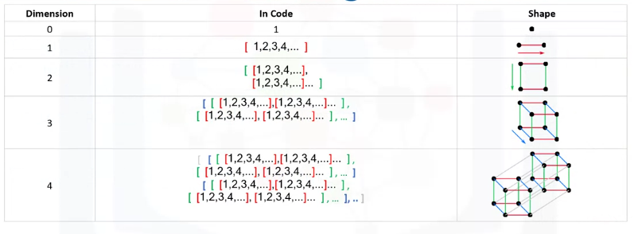

## Data Flow Graph
- nodes: represent mathematical operations
- edges: represent the tensors (multi-dimensional arrays)

Data flow graph allows visualization of parts of the graph, and shows how data flows between operations

Example of dataflow graph, showing how tensors and operations build the graph. 
- placeholders are holes in the model - places where we can add the data from outside the graph
- `tf.Variable()` are used to share and persist values that are then manipulated later
- when using `tf.Variable()`, or `tf.placeholder()`, TF adds an operation to the graph.

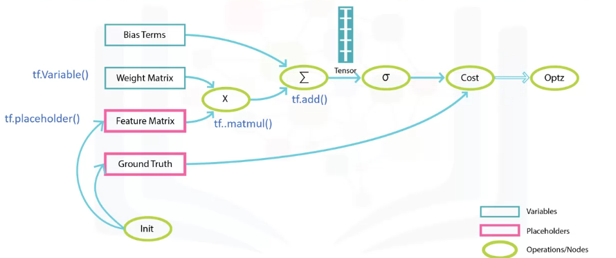

## Changes in TensorFlow 2.x
- Keras is the default high-level API for TensorFlow
- better usability of GPU, and multi-GPU support
- Eager Execution (activated by default, and is recommended way of using TensorFlow API)
    - Earlier, `tf.Session()` used to be needed, which was hard to debug
    - makes TF code look like ordinary Python code

## Introduction to Deep Learning

Deep Learning is series of supervised, semi-supervised, or unsupervised methods that to try to solve machine learning problems using deep neural networks

DNNs are mostly used in data types where feature selection process is difficult e.g. images, text, sounds.

## Deep Neural Networks

### CNN
Suppose you want to build a model that differentiates images of cats and dogs. Typically, the first step in building such a model is *feature extraction* - choosing the best predictive features in an image (e.g. color, edges, pixel location), and then feeding into a shallow neural network.

This is very difficult, time consuming, and the feature extraction work doesn't transfer to other classification tasks.

Instead, CNNs more accurately and automatically find the best features to use!

A CNN learns multiple levels of feature sets at different levels of abstraction

### RNN

- tries to solve problem of modelling *sequential* data (when current data point, depends on previous data point)
    - e.g. stock price prediction, sentiment analysis, speech to text

### RBM
- shallow neural nets that try to reconstruct input data
- automatically extract meaningful features, without need of labelling them

Applications:
- significant as building block of other networks, e.g. DBN
- Feature extraction / learning
- Dimensionality Reduction
- Pattern Recognition
- Recommender Systems (Collaborative Filtering)
- Handling missing values
- Topic modelling

### Deep Belief Networks (DBN)
- built on top of RBMs - stacking multiple RBMs
- was invented to solve back-propagation vanishing gradient problem.
- generally used for classification / image recognition
- very accurate discriminative classifier, and does not need a lot of data to train

# Week 2 - Convolutional Neural Networks (CNNs)

## CNN Architecture
- kernel === filter used in convolution
- applying multiple kernels to the image, results in multiple convolved images
- leveraging different kernels, allows us to find different patterns in an image (e.g. edges, curves, etc.)
- output of convolution is called "feature map"
- typically, you initialize the kernel with random values. Then during the training phase, the kernel will be optimized in such a way to predict the proper output (learning)
- kernel is essentially the weights between the layers of neurons in a regular Neural Network
- Pooling layer is used to reduce dimensionality of previous layer's ReLU neurons
- The Fully connected layers take the high-level filtered images from the previous layer and convert them into a vector

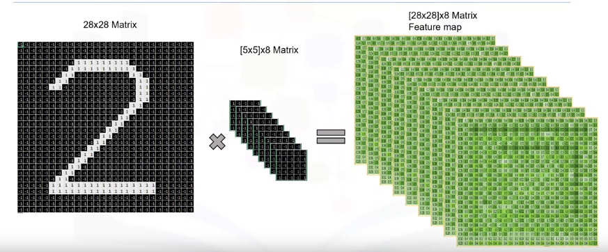

Example of applying 8 different kernels:

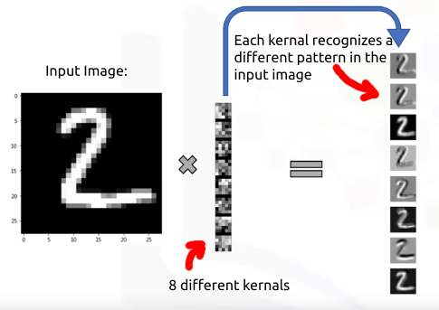

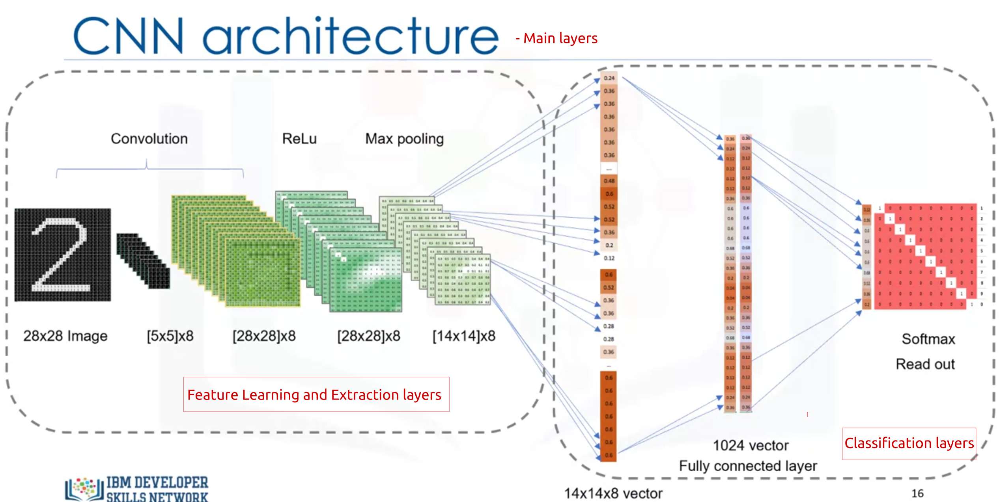

Multiple layers can be stacked

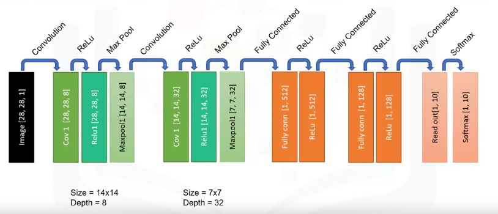
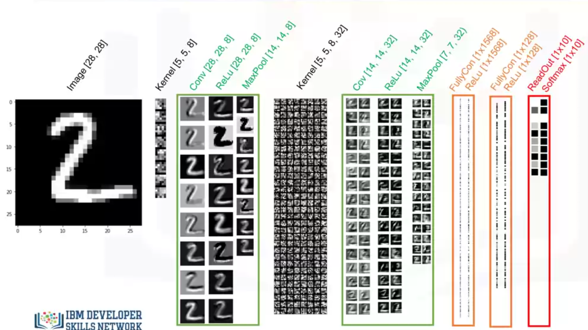

During training, a CNN learns the weights (**kernels**!) and biasses between the layers of the network 

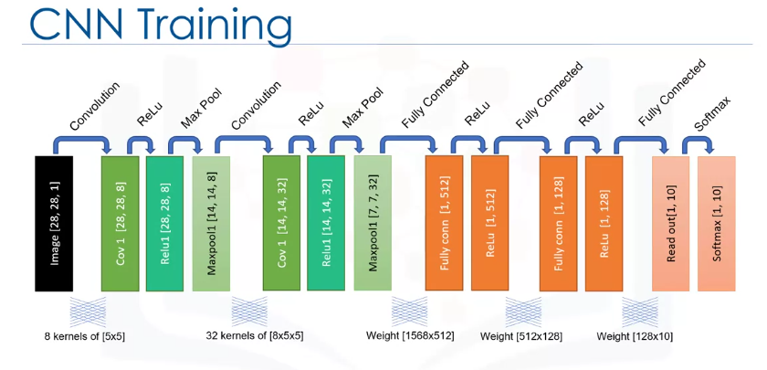

# Week 3 - Recurrent Neural Networks (RNNs)

## The Sequence Problem
- not able to use a regular feed-forward neural network for sequential data, since it assumes that each data point is independent of the others and analyzes it in isolation.

## The RNN Model
- tool for modelling sequential data
- remembers state/context/previous analysis
- the state recurs back in as an input

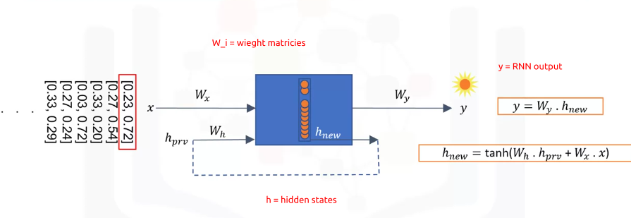

### Types of Applications of RNN:
- many to many: speech recognition
- one to many: image captioning (string recognized objects in image as words, and form a caption). One image input, output a list of words
- many to one: Sentiment Analysis - Sequence of words to overall sentiment

### RNN Problems
- network needs to remember all states at any given time
    - computationally expensive
    - instead, only store portion of recent states in a time window
- Extremely sensitive to changes in their parameters
    - Gradient Descent optimizers may struggle to train the network
- Vanishing Gradient Problem
- Exploding Gradient Problem
- Thus, this Vanilla RNN cannot learn long sequences very well

## The LSTM Model
- type of RNN that solves problems of Vanilla RNN
- maintains strong gradient over many time steps ==> can train relatively long sequences
- LSTM unit is composed of 4 elements:
    - memory cell: holds data
    - 3 logistic gates: Write, Read, and Forget gates. These define flow of data inside LSTM and data in memory cell
- Thus, RNN is able to remember what it needs, and forget what is no longer useful
- LSTM keeps 2 infos as it propagates through time
    - hidden state: the memory the LSTM accumulates using its gates through time
    - previous time step output
- stacked LSTM can create a more complex feature representation of the current input (makes model deeper and leads to more accurate results)

LSTM Unit

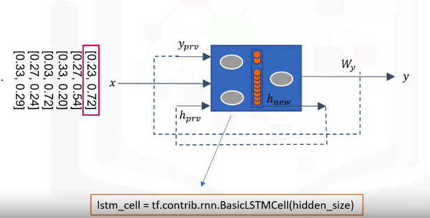

LSTM through timesteps

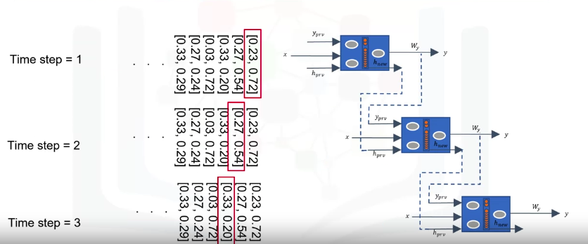

Stacked LSTMs

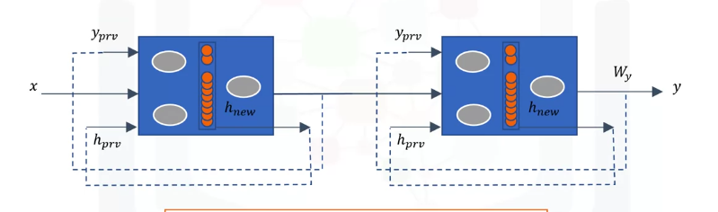

### Training Process

During training, the network learns the weights and biases used in each gate for each layer. In detail, it learns:
- how much old information to forget, through the Forget gate (weights `Wf`, `bf`)
- how much new information (`x`) to incorporate, through the Input gate (weights `Wi`, `bi`)
- weights for calculation of new state based on current input and previous state(weights `Wh`, `bh`)
- how much of cell state to output to the Output gate

Parameters updated during training an LSTM

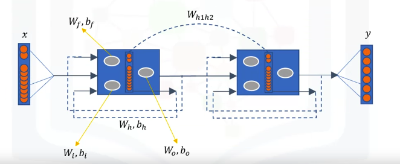

## Applying RNNs to Language Modelling

Language modelling is a gateway to applications such as Speech recognition, Machine Translation, Image captioning

Language Modeling is the process of assigning probabilities to sequences of words. 
- e.g. next word prediction
    - input data = most recent word
    - sequence of words so far = context
    - output = prediction + new context (containing input data)
    - training is done by passing each word one at a time

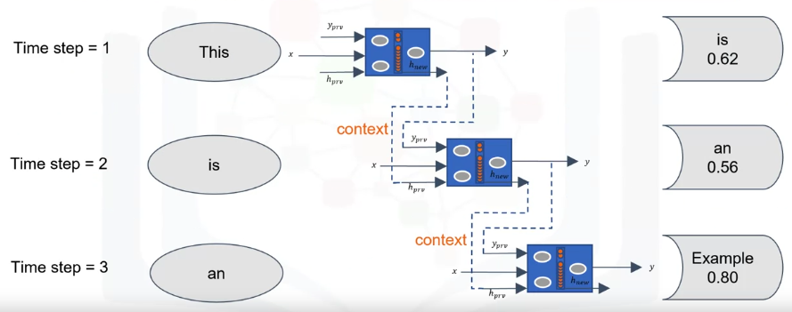

### Word embedding
- word is converted to a numerical vector
- intially, the encoded vector is random
- during training, the vector values are updated based on the context into which the word is being inserted.

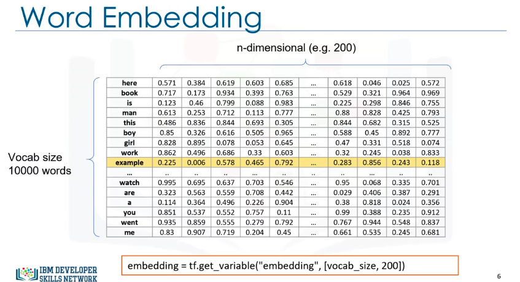

Training Word Embeddings:

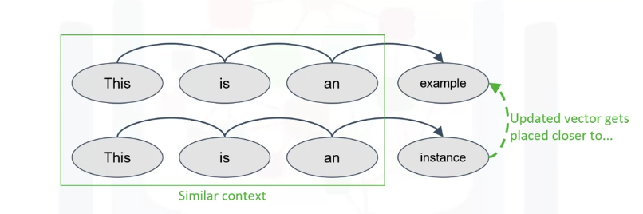

When visualizing embeddings using dimensionality reduction, will see semantically similar words grouped together

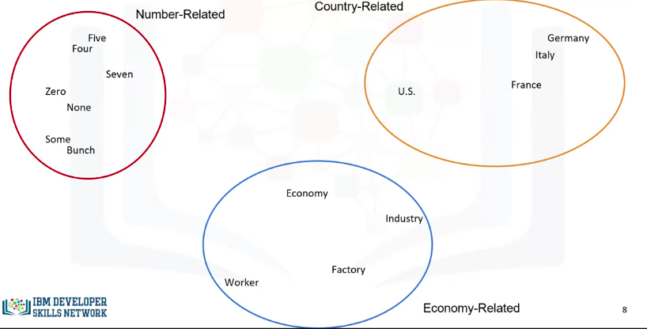

Training Process:
- Note: Green parameters below is what is *learnt* when error is back-propagated

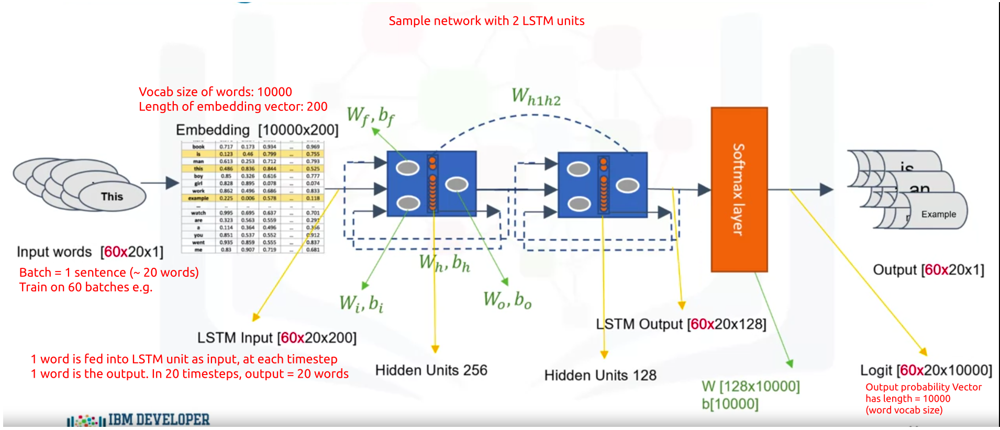

# Week 4 - Restricted Boltzmann Machines (RBMs)
- Used for collaborative filtering - a type of recommendation system, dimensionality reduction, feature extraction
    - Collaborative filtering: method of making automatic predictions (filtering) about the interests of a user by collecting preferences or taste information from many users (collaborating).
- Shallow neural networks - only have 2 layers: input layer (visible), and hidden layer
- unsupervised, used to find patterns in data by reconstructing its input
- called 'restricted' because the neurons within the same layer are not connected.

- RBM can represent its input with hidden values, aka *latent* values.
- a type of autoencoder. But RBM use stochastic approach while autoencoders use deterministic approach

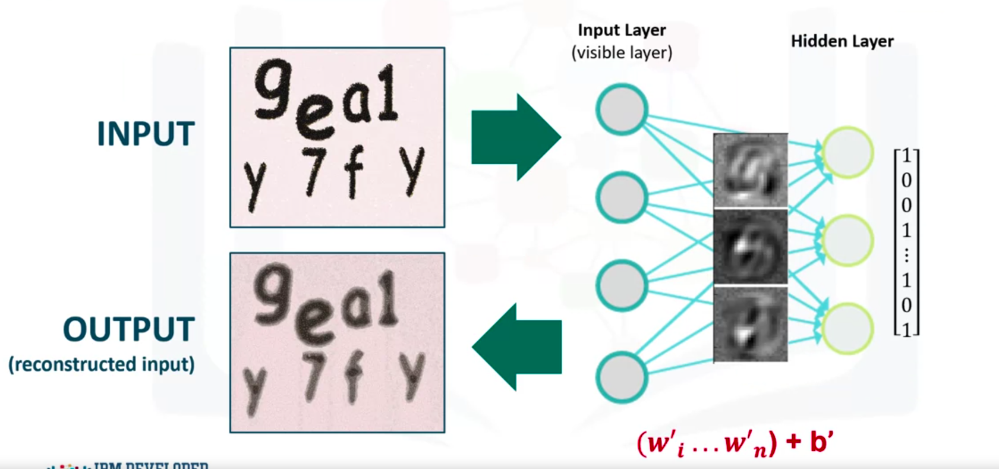

## Learning Process

1. Forward pass
- the input image is converted to binary values & then the vector input is fed into the network where its values are multiplied by weights and an overall bias in each hidden unit.
- Then, the result goes to an activation function, such as the sigmoid function
- Then, a sample is drawn from this probability distribution, and defines which hidden neurons may or may not activate. This means it makes stochastic decisions about whether or not to transmit that hidden data. The intuition behind the sampling is that there are some random hidden variables and by sampling from the hidden layer, you can reproduce sample variance encountered during training.
- i.e. forward pass translates the inputs into a set of binary values that get represented in the hidden layer

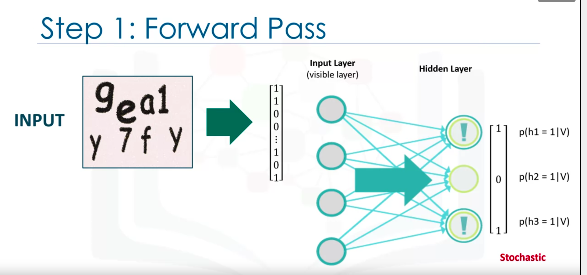

2. Backward pass.
- the activated neurons in the hidden layer send the results back to the visible layer, where the input will be reconstructed.
- The data that is passed backwards is also combined with the same weights and overall bias that were used in the forward pass.
- So once the information gets to the visible layer, it is in the shape of the probability distribution of the input values given the hidden values.
- And sampling the distribution, the input is reconstructed.
- i.e. The backward pass is about making guesses about the probability distribution of the original input.

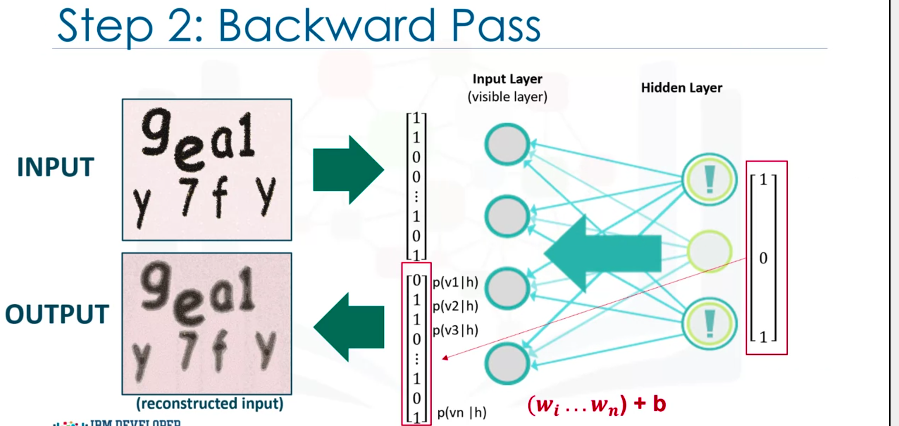

3. Assessing the quality of the reconstruction by comparing it to the original data.
- calculate the error and adjust the weights and bias in order to minimize it.
- in each epoch, we compute the error as a sum of the squared difference between step 1 and the next step.

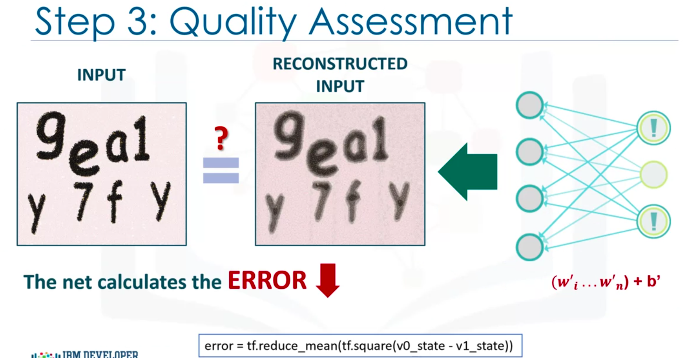

## Why use RBMs?
- they excel when working with unlabeled data. Many real word data are unlabelled e.g. images, audio files.
- they extract important features from the input
- more efficient at Dimensionality Reduction than PCA

# Week 5 - Autoencoders

- unsupervised neural net that will find patterns in dataset by extracting key features. e.g. key points in a face for arbitrary task (e.g. detecting emotion later), by recreating the given input
- used for Feature Extraction, Data Compression, **Learning generative models of data**, dimensionality reduction
- can extract key image features, improve training times of other networks (through reducing # of dimensions), and improve separability of dimensionally-reduced datasets compared to PCA

## Curse of Dimensionality
- High dimensional data is a problem for ML tasks

Time to fit a model is at best:

## Comparison against PCA for dimensionality reduction

The below image shows PCA (left) and Autoencoder (right) applied to the MNIST dataset, for reducing it to 2 dimensions. We see the data is more separable from the autoencoder output

Data output on MNIST digits: 

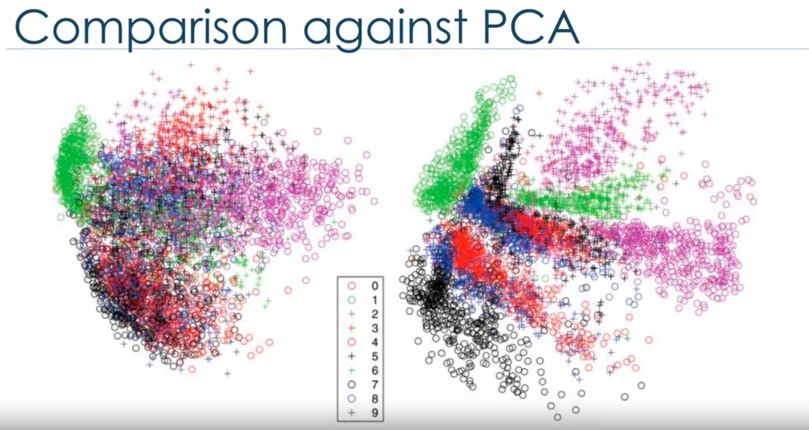

## Architecture
- has a few hidden layers, but still is a shallow network.
- made up of 2 parts: encoder, and decoder

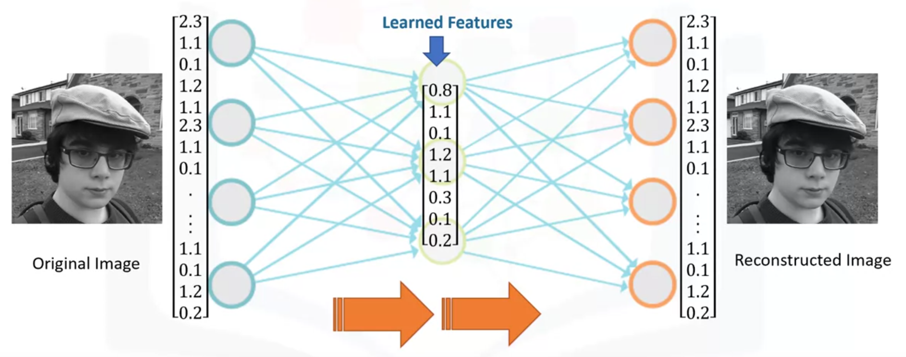

- "code layer" is the encoded value / picture.
- numbers in blue are the *dimensions* at that layer:

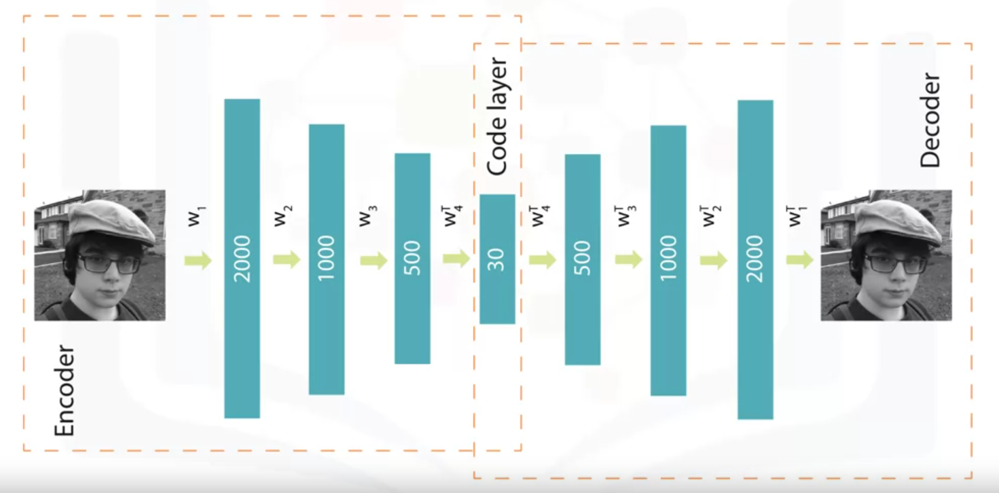

During training, the decoder i.e. forces the autoencoder to select the most important features in the compressed representation ('code layer')

For use of the autoencoder, we don't really care about the reconstructed image from the network (other than for training). What we *do* care about is the values in the 'code layer'. If the network has learnt enough that it can replicate the input image based on only the code layer values, then the code layer is good enough feature set to represent the input image.

After training, we can use the encoded data that has been dimensionally reduced (i.e values in code layer) for the arbitrary application. The arbitrary application could be clustering, classification, or visualization of our data.

## Learning Process
- they use backpropagation
- loss measured is the amount of info lost in the reconstructed input
