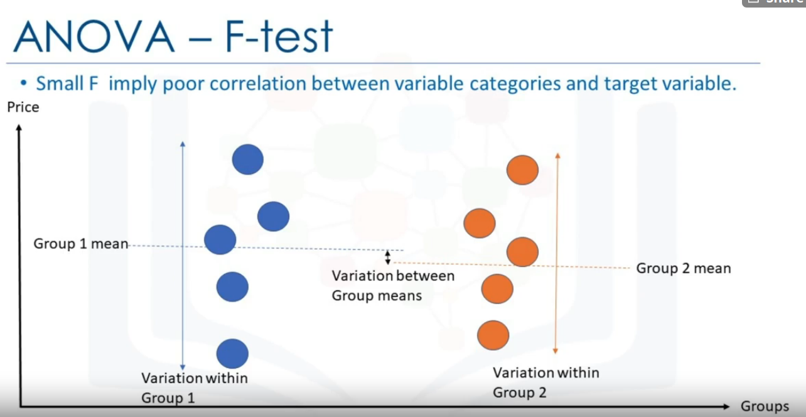

Jupyter Notebook Cheet sheet: https://cheatography.com/weidadeyue/cheat-sheets/jupyter-notebook/ 

# Week 1 - Intro
Data Analsis/Science helps answer questions by looking at data. 

Ex. What should the price of our used car be?

Data Science Thinking:
- Is there data on prices of other cars and their characterisistcs?
- what features of cars affect prices? e.g. color, horsepower, etc. 

features = attributes = characteristics

target value = label = value we want to predict. (Price in this case)


Python Packages in Data Science:
1. Scientific Computing libraries:
- Pandas offers data structure and tools for effective data manipulation and analysis. It provides fast access to structured data. Uses 'dataframes'
- NumPy library uses arrays for its inputs and outputs. Fast Array processing
- Scipy - functions for math problems e.g Integrals, solve Differential Equations, optimization, 
2. Data Visualization
- Matplotlib, Seaborn (based on MatplotLib)
3. Algorithimic Libraries
- Scikit-learn -- ML, regression, classification. Built on NumPy, scipy, matplotlib
- Statsmodels -- explore data, estimate statistical models, and perform statistical tests. 

Read CSV into pandas:
```python
import pandas as pd
# read the online file by the URL provided above, and assign it to variable "df"
path="https://archive.ics.uci.edu/ml/machine-learning-database/autos/imports-85.data"

df = pd.read_csv(path,header=None)
df.head() # or df.info()
```
- can save dataframe as csv file

When doing basic data exploration, check data types in columns of dataframe using `df.dtypes` to make sure it makes sense/ or if it needs to be changed 

Accessing Pandas Data:
- `df['colName']` returns a series from the dataframe `df`
- `df[['colName']]` returns a dataframe from the dataframe `df`

Statisical summary: `df.describe()``
- can also generate statistics for all columns (including string based columns)

Access Database in Python 

Python DB API: (for relational databases)
- Connection Objects -- for DB connections and managing transactions
- Cursor Objects -- for performing DB queries

# Week 2 - Data Wrangling
Data preprocessing: converting data from 'raw' form, to another format in order to prepare data for further analysis
- aka data cleaning, data wrangling

Handling missing values:
- can drop the variable (column), or simply drop the entry
    - only drop the column if many values are missing
- could also replace missing data with average of the column, or most frequent (e.g for categorial values). See ipython notebook `2`
- could leave the data as is (not likely going to be doing this)

Pandas data types and conversion https://pbpython.com/pandas_dtypes.html
- `.astype('type')`
Pandas also has a categorical type https://realpython.com/python-pandas-tricks/#5-use-categorical-data-to-save-on-time-and-space 

Data can bias model to weigh one attribute more than the other, simply because of it's range. e.g. age vs income. 
- To avoid this, we can `normalize` by:
    - simple feature scaling (old/max) --> will range from 0 to 1
    - min-max (old-min/range) --> 
    - z-score (old-mu/sigma) --> 

Binning data:
- create bins using `np.linspace`
- create categorial variable values for binned item
- use `pd.cut` to split data into the `bins`

Can convert categorial values into numeric variables
- one-hot encoding. `pd.get_dummies(df['column_name'])`

# Week 3 - Exploratory Data Analysis

Purpose of Exploratory Data Analysis is to:
- summarize main characteristcs of data
- gain better understanding of data set, 
- extract important variables and uncover relationships between variables

Descriptive Statistics:
- For numerical variables: `df.describe()`
- For categorial: `df['column'].value_counts()`
- Box plots
- Scatter plots: predictor = independant variable, target=dependant var

Grouping Data:
- `dataframe.Groupby()` is used on categorical variables
    - https://realpython.com/pandas-groupby/
    - groups data into subsets according to different categories of the variable
    - passing in multiple columns into the `groupby` groups dataframe by unique combinations of the two columns. 
        - See Notebook 3
 
e.g. To find average price of each car based on the categorical variable "body-style":

`df[['price','body-style']].groupby(['body-style'],as_index= False).mean()`

Pivot table: - one variable displayed along columns, and other variables displayed along rows.
    - used on the result of `groupby` in order to better tabulate data.
    
Heatmaps can be used to plot data from pivot tables

Correlation: measuring extent to which different variables are interdependant.

`df.corr()` - Find pairwise correlation of `int64` or `float64` dtypes
- entry in the matrix indicates correlation between the two variables

Pearson correlation: measures strength of correleation for continuous numerical variables by giving correlation coefficent and P-value. 
- coefficent: strength and direction of correlation
- P-value: how certain we are about the calculated correlation coefficent
    - strong: p-value<0.001
    - moderate: p-value<0.05
    - weak: p-value<0.1
    - no certainity- s: p-value>0.1
    
- can create a heatmap for showing relation of each variable to each other


ANOVA: Analysis of Variance
- for finding correlation between different groups of a categorical variable
- F-test: variation between sample group means divided by variation within sample group
   - small F implies poor correlation between variable categories and target variable
- shows variance between 2 different groups of a categorial variable
    - would need to `groupby` data first, in order to create the 2 groups
- ANOVA:`scipy.stats.f_oneway`




## Visualizations

Correlation of numeric variables can be visualized using `seaborn.regplot(x="col1",y="col2",data=df)`
- steeper line ==> stronger correlation
For categorial variables, use `seaborn.boxplot()`
- Less overlap of distributions of box plot in different groups of the same variable ==> stronger correlation with the variable
