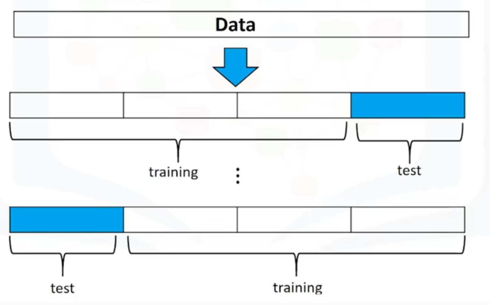
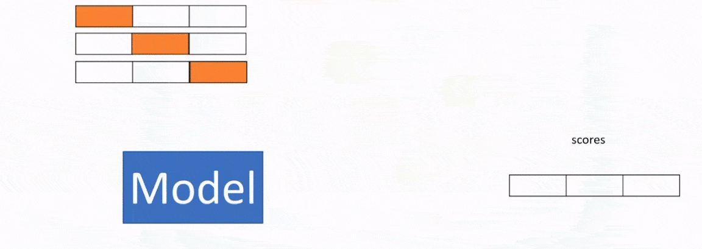

Jupyter Notebook Cheet sheet: https://cheatography.com/weidadeyue/cheat-sheets/jupyter-notebook/ 

# Week 1 - Intro
Data Analsis/Science helps answer questions by looking at data. 

Ex. What should the price of our used car be?

Data Science Thinking:
- Is there data on prices of other cars and their characterisistcs?
- what features of cars affect prices? e.g. color, horsepower, etc. 

features = attributes = characteristics

target value = label = value we want to predict. (Price in this case)


Python Packages in Data Science:
1. Scientific Computing libraries:
- Pandas offers data structure and tools for effective data manipulation and analysis. It provides fast access to structured data. Uses 'dataframes'
- NumPy library uses arrays for its inputs and outputs. Fast Array processing
- Scipy - functions for math problems e.g Integrals, solve Differential Equations, optimization, 
2. Data Visualization
- Matplotlib, Seaborn (based on MatplotLib)
3. Algorithimic Libraries
- Scikit-learn -- ML, regression, classification. Built on NumPy, scipy, matplotlib
- Statsmodels -- explore data, estimate statistical models, and perform statistical tests. 

Read CSV into pandas:
```python
import pandas as pd
# read the online file by the URL provided above, and assign it to variable "df"
path="https://archive.ics.uci.edu/ml/machine-learning-database/autos/imports-85.data"

df = pd.read_csv(path,header=None)
df.head() # or df.info()
```
- can save dataframe as csv file

When doing basic data exploration, check data types in columns of dataframe using `df.dtypes` to make sure it makes sense/ or if it needs to be changed 

Accessing Pandas Data:
- `df['colName']` returns a series from the dataframe `df`
- `df[['colName']]` returns a dataframe from the dataframe `df`

Statisical summary: `df.describe()``
- can also generate statistics for all columns (including string based columns)

Access Database in Python 

Python DB API: (for relational databases)
- Connection Objects -- for DB connections and managing transactions
- Cursor Objects -- for performing DB queries

# Week 2 - Data Wrangling
Data preprocessing: converting data from 'raw' form, to another format in order to prepare data for further analysis
- aka data cleaning, data wrangling

Handling missing values:
- can drop the variable (column), or simply drop the entry
    - only drop the column if many values are missing
- could also replace missing data with average of the column, or most frequent (e.g for categorial values). See ipython notebook `2`
- could leave the data as is (not likely going to be doing this)

Pandas data types and conversion https://pbpython.com/pandas_dtypes.html
- `.astype('type')`
Pandas also has a categorical type https://realpython.com/python-pandas-tricks/#5-use-categorical-data-to-save-on-time-and-space 

Data can bias model to weigh one attribute more than the other, simply because of it's range. e.g. age vs income. 
- To avoid this, we can `normalize` by:
    - simple feature scaling (old/max) --> will range from 0 to 1
    - min-max (old-min/range) --> 
    - z-score (old-mu/sigma) --> 

Binning data:
- create bins using `np.linspace`
- create categorial variable values for binned item
- use `pd.cut` to split data into the `bins`

Can convert categorial values into numeric variables
- one-hot encoding. `pd.get_dummies(df['column_name'])`

# Week 3 - Exploratory Data Analysis

Purpose of Exploratory Data Analysis is to:
- summarize main characteristcs of data
- gain better understanding of data set, 
- extract important variables and uncover relationships between variables

Descriptive Statistics:
- For numerical variables: `df.describe()`
- For categorial: `df['column'].value_counts()`
- Box plots
- Scatter plots: predictor = independant variable, target=dependant var

Grouping Data:
- `dataframe.Groupby()` is used on categorical variables
    - https://realpython.com/pandas-groupby/
    - groups data into subsets according to different categories of the variable
    - passing in multiple columns into the `groupby` groups dataframe by unique combinations of the two columns. 
        - See Notebook 3
 
e.g. To find average price of each car based on the categorical variable "body-style":

`df[['price','body-style']].groupby(['body-style'],as_index= False).mean()`

Pivot table: - one variable displayed along columns, and other variables displayed along rows.
    - used on the result of `groupby` in order to better tabulate data.
    
Heatmaps can be used to plot data from pivot tables

Correlation: measuring extent to which different variables are interdependant.

`df.corr()` - Find pairwise correlation of `int64` or `float64` dtypes
- entry in the matrix indicates correlation between the two variables

Pearson correlation: measures strength of correleation for continuous numerical variables by giving correlation coefficent and P-value. 
- coefficent: strength and direction of correlation
- P-value: how certain we are about the calculated correlation coefficent
    - strong: p-value<0.001
    - moderate: p-value<0.05
    - weak: p-value<0.1
    - no certainity- s: p-value>0.1
    
- can create a heatmap for showing relation of each variable to each other


ANOVA: Analysis of Variance
- for finding correlation between different groups of a categorical variable
- F-test: variation between sample group means divided by variation within sample group
   - small F implies poor correlation between variable categories and target variable
- shows variance between 2 different groups of a categorial variable
    - would need to `groupby` data first, in order to create the 2 groups
- ANOVA:`scipy.stats.f_oneway`


## Visualizations

Correlation of numeric variables can be visualized using `seaborn.regplot(x="col1",y="col2",data=df)`
- steeper line ==> stronger correlation
For categorial variables, use `seaborn.boxplot()`
- Less overlap of distributions of box plot in different groups of the same variable ==> stronger correlation with the variable

# Week 4 - Model Development

We will try to determine a reasonable price, for a used car.

- Polynomial Regression and Pipelines
- R-squared and MSE
- Prediction and Decision making


Model:
- thought of as a matematical equation used to predict a value, given one or more other values
- relating one or more independant variables to dependant variable
- more relvant data ==> more accurate model


- Regression ==> finding line of best fit

Simple Linear Regression (SLR)
- single independant variable
- finding the cofficents `b0,b1` in `y=b0+b1*x`
- use training points to _fit_ a model, then use the model to _predict_ an estimate.
- `y_hat` denotes an estimate

```python
#import from sci-kit learn
from sklearn.linear_model import LinearRegression
# Create model
lm = LinearRegression
# define predictor and target variable
X  = df[['mpg']]
Y  = df[['price']]
# fit
lm.fit(X,Y)
# b0 = lm.intercept_
# b1 = lm.coef_

#predict:
Yhat=lm.predict(X)
```

Multiple Linear Regression
- for finding relationship between two or more predictor (X) variables, and one continuous target (Y) variable
- SLR, extended to multiple dimensions and more coefficents.
- finding the cofficents `b0,b1,b2,b3...` in `y= b0 + b1*x1 + b2*x2 + b3*x3`

```python
# Same as before, except X variable is now multiple dimensions:
Z = df[['horsepower','weight','engine-size','mpg']]
Y  = df[['price']]
# fit
lm.fit(Z,Y)
#predict:
Yhat=lm.predict(Z)
```

## Model Evaluation using Visualization
Regression Plot:
- shows good estimate of relationship between two variables

```python
import seaborn as sns
sns.regplot(x="mpg",y="price",data=df)
plt.ylim(0,)
```

Residual plot:
- plot of error between actual value and predicted value. (`target - prediction`)
- expect to see plot have mean of `0` and spread out evenly (randomly) around x-axis with similar variance
   - if so, then linear model is appropriate
- if residual plot has curvature, or not randomly spread out then non-linear model may be needed
- model is incorrect if variance changes with x.

```python
import seaborn as sns
sns.residplot(df['mpg'],df['price'])
```

Distribution Plot
- shows counts of predicted value vs actual values. This helps in seeing if model matches expected output
- i.e. a layered Histogram
- Gaussian curve is often superimposed over vertical bar histogram since data is continuous
- good for multivariate input data
    - distplot visualizes distribution of a single variable.
- if model doesn't match up well with actual value, may need more data in that area, or possibly use a non-linear model


Below is an example of DistPlot:
```python
import seaborn as sns
ax1 = sns.kdeplot(df['price'], color="r", label="Actual Value")
sns.kdeplot(Y_hat, color="b", label="Fitted Values" , ax=ax1)
```
- https://seaborn.pydata.org/generated/seaborn.distplot.html
- https://seaborn.pydata.org/generated/seaborn.histplot.html
- https://seaborn.pydata.org/generated/seaborn.displot.html


## Polynomial Regression and Pipelines
- for curvilinear relationships. 
    - predictor variables have exponent > 1
    - e.g. quadratic, cubic, higher order...

For single dimension polynomial regression (only one predictor variable):
```python
import numpy as np
f = np.polyfit(x,y,3)
p = np.poly1d(f)
print(p)
```

Multidimension polynomial regression is more complicated. Numpy can't handle it. 
- use `sklearn.preprocessing` instead

```python
from sklearn.preprocessing import PolynomialFeatures
pr = PolynomialFeatures(degree=2,include_bias=False)
pr.fit_transform([dimension1,dimension2])
```

To be able to perform multidimension polynomial regression, we need to transform input features using `PolynomialFeatures`, and then use those new features as inputs to a regular `LinearRegression`

Link about what `Polynomial Features` are: 
- https://machinelearningmastery.com/polynomial-features-transforms-for-machine-learning/
- https://acadgild.com/blog/polynomial-regression-understand-power-of-polynomials
- A common pattern within machine learning is to use linear models trained on nonlinear functions of the data
- Polynomial regression is a special case of linear regression, by the fact that we create some polynomial features before creating a linear regression.


https://scikit-learn.org/stable/modules/generated/sklearn.preprocessing.PolynomialFeatures.html
- `fit_transform` is the same as calling `.fit()`, then `.transform()`


- The sklearn API has `fit` which computes the features. 
- Then `transform` then computes outputs based on the `fit`

As dimension of input data gets larger, we may want to normalize multiple features. For this, we use pre-processing library in `sklearn`:
- can normalize each feature simultaneously using [`sklearn.preprocessing.StandardScaler`](https://scikit-learn.org/stable/modules/generated/sklearn.preprocessing.StandardScaler.html)
    - ML Estimators often work better on data where distribution is mean=0 and std. dev.=1. [Source](https://stackoverflow.com/questions/40758562/can-anyone-explain-me-standardscaler)
    - `StandardScaler` normalizes each feature / column / dimension of input data independently
    - First, `fit` the data (calculate mean and variance). Then `transform` the input data, to do the actual scaling

Scikit-Learn Pipelines
- [`sklearn.pipeline.Pipeline`](https://scikit-learn.org/stable/modules/compose.html#pipeline) helps simplify code using their `Transformer` API
- Often in ML tasks you need to perform sequence of different transformations (find set of features, generate new features, select only some good features) of raw dataset before applying final estimator.
- ML Predictions often involve transforming the data in multiple ways, before being able to predict a value. This can be encapsulated into a _pipeline_.
- Pipelines sequently perform a series of _transformations_. The last step of a pipline is a _prediction_ (_estimator_). It encapsulates transformers and predictors inside.
- helps avoid leaking training and testing data with each other.
- build using a list of ``(key, value)`` pairs, where the `key` is a string containing the name you want to give this step and `value` is an estimator object
- can train the entire pipeline using `pipe.fit()`
- then `pipe.predict()`

E.g. of a Pipeline:
1. Normalization (transform)
2. Polynomial Transform (transform)
3. Linear Regression (prediction)

More good links:
- https://stackoverflow.com/questions/33091376/python-what-is-exactly-sklearn-pipeline-pipeline
- https://towardsdatascience.com/a-simple-example-of-pipeline-in-machine-learning-with-scikit-learn-e726ffbb6976
- https://scikit-learn.org/stable/auto_examples/model_selection/grid_search_text_feature_extraction.html

## Measuring In-sample evaluation (Numerical model evaluation)
- numerically determining fit of model on dataset can be done through measuring:
   - Mean Squared Error (MSE). `sklearn.metrics.mean_squared_error`
   - R^2 (shows how close data is to fitted regression line). Using the LinearRegression object from sklearn,`lm.score()`

## Prediction and Decision Making
We need to determine if the model is correct. We can check:
- do predicted values make sense?
- use visualization
- see numerical measures of evaluation
- compare different models

# Week 5 - Model Evaluation and Refinement

In-sample evaluation tells how well our model will fit data used to train it. But, it doesn't tell how well trained model can be used to predict new data. 

Solution: split data into *training* (in-sample evaluation) and *test* (out-of-sample evaluation) data. This a common pattern in supervised ML.

For splitting data, usually 70% of data is for training, and 30% for testing. 
- use training set to build and train model
- use testing set to assess model performance

When done testing, should use *all* data to train model.

`sklearn` has a function to randomly split data sets into training and testing subsets. 
```python
from sklearn.model_selection import train_test_split
x_train,x_test, y_train, y_test = train_test_split(x_data,y_data,test_size=0.3,random_state-0)
# y is target, x is predictor variables
```

## Generalization Error
- measure of how well our data predicts previously unseen data
- error obtained when using testing data is an approximation of this error

Comparison:
- More training data and less test data ==> greater accuracy, but less precision
- Less training data and more test data ==> lower accuracy, but greater precision

## Cross validation

https://scikit-learn.org/stable/modules/cross_validation.html
- There is a risk of overfitting model on test set because hyperparameters can be tweaked until estimator performs optimally. This no longer generalizes well. 

To get better performance, we use **cross validation**:
- split data into `k` equal groups. A group aka a *fold*
- We use some folds for training, and some for testing
- Next, we do the same, but choose different folds for training and testing sets
- Repeated until each fold/partition/group is used for both training and testing.

Then at end, use average result as out of sample error. Metric depends on model. e.g. R^2



`cross_val_score()`
- performs multiple out-of-sample evaluation
- returns _score_ of model, for each "iteration" of validation
```python
from sklearn.model_selection import cross_val_score
lr = LinearRegression()
# 3 folds
scores=cross_val_score(lr,x_data,y_data,cv=3)
# cross_val_score returns an array.
np.mean(scores)
```
Below is an animation of cross-validation in the above code snippet. Orange is testing fold, white boxes are training data. Red is the entry in the `scores` array (R^2 value in this case).



`cross_val_predict()`
- Similar to `cross_val_score()`, except returns predicted values instead of scores.
```python
from sklearn.model_selection import cross_val_predict
lr = LinearRegression()
# 3 folds
yhat==cross_val_predict(lr,x_data,y_data,cv=3)
# cross_val_predict returns an array.
```


## Overfitting, Underfitting and Model Selection

When performing polynomial regression, we will need to choose the order of polynomial

Goal of Model Selection is to determine the order of
the polynomial to provide the best estimate of the function y(x). 

Underfitting: where the model is too simple to fit the data

Overfitting: model starts to fit the *noise*, rather than the function. Or, fits really well to training data, but gives no useful predictions on testing data. 

Training MSE Error decreases as order of polynomial decreases, but testing error would increase. We choose polynomial order that has lowest Test Error / highest R^2 value. 

Example of checking R^2 values of a polynomial, for different orders:
```python
Rsquared_test = []
order = [1,2,3,4]
for n in order:
    pr=PolynomialFeatures(degree=n)
    x_train_pr = pr.fit_transform(x_train[['horsepower']])
    x_test_pr = pr.fit_transform(x_test[['horsepower']])
    lr.fit(x_train_pr,y_train)
    Rsquared_test.append(lr.score(x_test_pr,y_test))
```

## Ridge Regression
- prevents overfitting
- controls coefficents for higher order terms in polynomial by introducing `alpha`.
- `alpha` is selected before fitting/training model
- larger alpha means smaller coefficents ==> making model more underfitting
- to select correct `alpha`, use cross-validation

```python
from sklearn.linear_model import Ridge
RidgeModel = Ridge(alpha=0.1)
RidgeModel.fit(x,y)
Yhat=RidgeModel.predict(x)
```

## Grid Search

A *validation data set* is similar to a test data set, but it is used for selecting paramters. 

Grid Search
- allows to scan through multiple free parameters
- `alpha` is called a **hyperparameter**/**free parameter**. This is a paramter not part of fitting or training process, but of the model itself that is not learnt by the model. (i.e. passed as agruments to constructor)
- Grid Search takes training data and different values of the hyperparameters.
- Grid Search searches the hyper-parameter space for the best cross validation score.
- https://scikit-learn.org/stable/modules/grid_search.html
- A search consists of: 
    - an estimator (regressor or classifier such as sklearn.svm.SVC());
    - a parameter space;
    - a method for searching or sampling candidates;
    - a cross-validation scheme; and
    - a score function.
- Process to select the hyperparameter:
    - split dataset into three parts: the training set, validation set, and test set.
    - train the model for different hyperparameters.
    - Use the R-squared or MSE for each model. Select the hyperparameter that minimizes the mean squared error or maximizes the R-squared on the validation set.
    - Finally test our model performance using the test data. 
