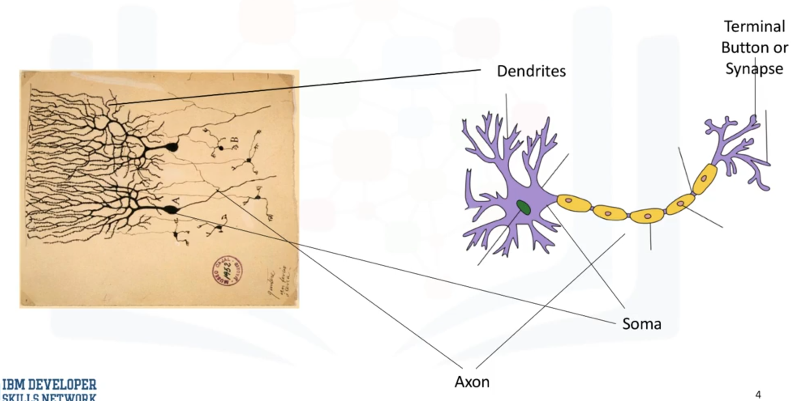
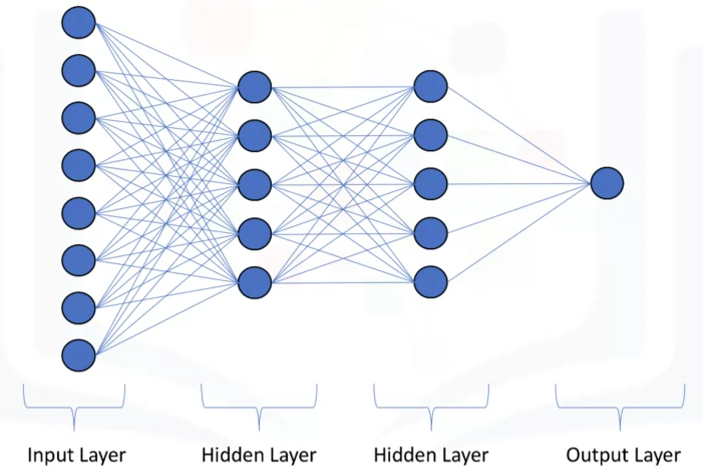
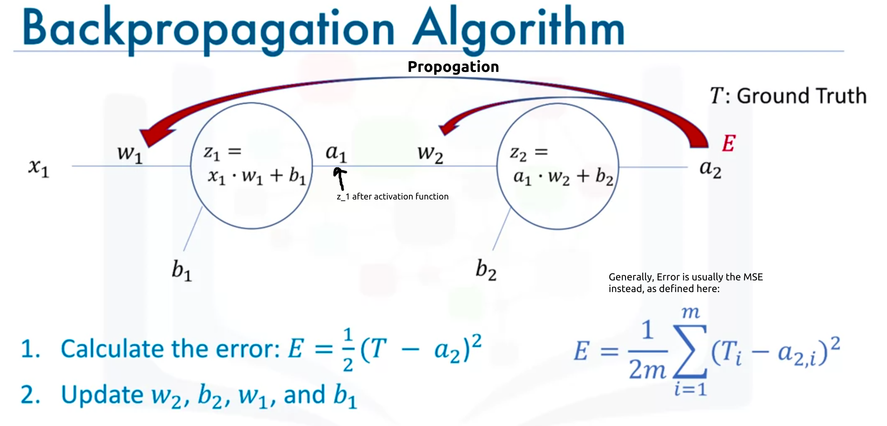
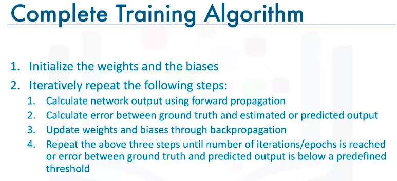
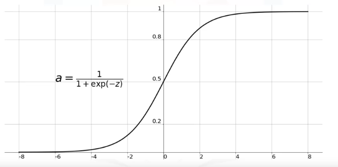
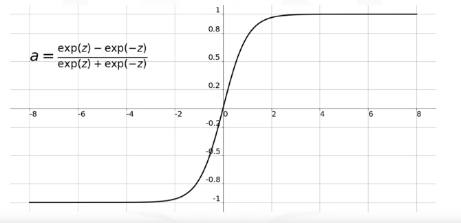
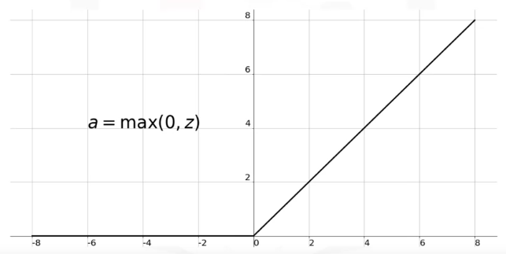
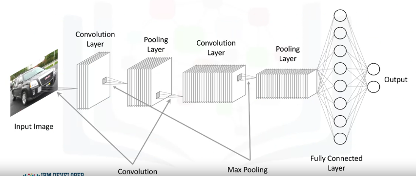
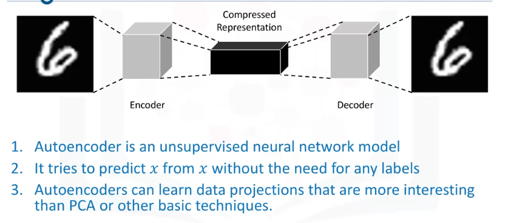

# Introduction to Deep Learning & Neural Networks with Keras

These are some notes for the [Introduction to Deep Learning & Neural Networks with Keras](https://www.coursera.org/learn/introduction-to-deep-learning-with-keras), meant to accompany the ipython notebooks

## Table of Contents:
- [Introduction to Deep Learning & Neural Networks with Keras](#introduction-to-deep-learning---neural-networks-with-keras)
- [Week 1 - Introduction to Deep Learning](#week-1---introduction-to-deep-learning)
  * [Biological Neural Networks](#biological-neural-networks)
  * [Artificial Neural Networks](#artificial-neural-networks)
  * [Forward Propagation](#forward-propagation)
- [Week 2 - Artificial Neural Networks](#week-2---artificial-neural-networks)
  * [Gradient Descent](#gradient-descent)
  * [Backpropagation](#backpropagation)
  * [Vanishing Gradient Problem](#vanishing-gradient-problem)
  * [Activation Functions](#activation-functions)
    + [Sigmoid function](#sigmoid-function)
    + [Hyperbolic tangent function](#hyperbolic-tangent-function)
    + [ReLU](#relu)
    + [Softmax function](#softmax-function)
- [Week 3 - Deep Learning Libraries](#week-3---deep-learning-libraries)
  * [Keras](#keras)
  * [Regression Models with Keras](#regression-models-with-keras)
  * [Classification Models with Keras](#classification-models-with-keras)
- [Week 4 - Deep Learning Models](#week-4---deep-learning-models)
  * [Shallow and Deep Neural Networks](#shallow-and-deep-neural-networks)
  * [Convolutional Neural Networks](#convolutional-neural-networks)
    + [Input Layer](#input-layer)
    + [Convolution Layer](#convolution-layer)
    + [Pooling Layer](#pooling-layer)
    + [Fully Connected Layer](#fully-connected-layer)
  * [CNN with Keras](#cnn-with-keras)
  * [Recurrent Neural Networks](#recurrent-neural-networks)
    + [LSTM](#lstm)
  * [Autoencoders](#autoencoders)
    + [Restricted Boltzmann Machines (RBMs)](#restricted-boltzmann-machines--rbms-)

# Week 1 - Introduction to Deep Learning


Example Applications of Deep Learning
- Colorizing grayscale pictures
- Speech reenactment - synchronzing lip movements in a video with an audio clip
- Automatic Handwriting Generation (typed text to human handwriting)
- OCR
- Automatically adding sounds to silent movies
- Object classification and detection in images

## Biological Neural Networks



Dendrites:
- receive electrical impulses which carry information, or data, from sensors or synapses of other adjoining neurons
- then carry the impulses or data to the soma. 

Soma
- contains nucleus of neuron.
- In the nucleus, electrical impulses, or the data, are processed by combining them together, and then they are passed on to the axon.  

Axon
- carries the processed information to the synapse, and the output of this neuron becomes the input to thousands of other neurons. 

Learning in the brain occurs by repeatedly activating certain neural connections over others, and this reinforces those connections. This makes them more likely to produce a desired outcome given a specified input. Once the desired outcome occurs, the neural connections causing that outcome become strengthened.

## Artificial Neural Networks
- structured similarly to biological neurons: many inputs/dendrites, a 'nucleus', and a single output / axon.

Layers of Neural Network:



## Forward Propagation
- process through which data passes through layers of neurons in a neural network from the input layer to the output layer
- neuron output = (linear weighted sum of inputs + bias) mapped to non linear space using activation function

Activation function:
- non linear transformation function (e.g. sigmoid function)
- decide whether a neuron should be activated or not, i.e. whether the info the neuron is receiving is relevant or not.
- neural network without activation function is basically just a linear regression model (`y = x1*w1+x2*w2+b1`)

# Week 2 - Artificial Neural Networks

## Gradient Descent

First we define a cost function

Then the optimized weights in the the cost function (minimizing it) are found through *Gradient Descent*

- iterative optimization algorithm for finding minimum of a function (cost function `f(x)`)
- take steps proportional to negative of the gradient of `f(x)` at the current point (recall Calc 3 / MTE 203)
- size of step is controlled by `learning rate` parameter (eta) -- larger learning rate = bigger steps
- new weights = current weights - learning rate * gradient of cost function @ current weights


## Backpropagation
- this is how NN optimize and learn their weights and biases, through multiple iterations / epochs
- (training is done in supervised learning setting)

Algorithm:
1. Calculate the error (E) between the predicted values and the ground truth labels
    - error = cost function now
    - error usually is MSE, of all predicated outputs compared to all expected ground truths
2. Propagate this error back into the network and use it to perform gradient descent on the different weights and biases in the network. i.e update each weight and bias using:




But error is not explicitly a function of w_i or b_i ==> use Chain Rule





## Vanishing Gradient Problem
- shortcoming of sigmoid function when used as activation function in the hidden layers of deep networks.
- Gradient of cost function (error) to weights in the earlier layers are very small, since every layer uses the sigmoid function
- Thus neurons in the earlier layers are the slowest to train/learn.
- So, we don't use sigmoid function as activation functions, since they are prone to vanishing gradient problem.

## Activation Functions

Types of Activation Functions
1. Binary Step Function
2. Linear Function
3. Sigmoid / logistic function
4. Hyperbolic Tangent function (tanh)
5. ReLU (Rectified Linear Unit)
6. Leaky ReLU
7. Softmax Function

Generally, should begin with using the ReLU activation function when building a model, and then switch to other activation functions in case ReLU doesn't yield optimum results.

### Sigmoid function 
- pretty flat beyond +-3 region ==> small gradient ==> vanishing gradient problem
- avoided in many applications nowadays
- values range from 0 to 1 ==> sigmoid is not symmetric about the origin.
    - sometimes we want different signs for the output of a neuron.




### Hyperbolic tangent function
- scaled version of the sigmoid function
- symmetric over the origin.
- still has vanishing gradient problem in very deep neural networks
- avoided in many applications nowadays



### ReLU
- most widely used activation function
- non-linear
- does not activate all the neurons at the same time --- if input < 0, neuron will not be activated ==> network will have sparse connections
- overcomes vanishing gradient problem
- only used in hidden layers



### Softmax function
- type of sigmoid function
- good for classification problems
- ideally used in the output layer of the classifier, where we're actually trying to get the probabilities to get the class of each input.
    - If a network with 3 neurons in the output layer outputs `[z1,z2,z3] = [1.66,0.55,0.98]`, with a softmax activation function, the outputs are converted to `[a1,a2,a3] = [0.51,0.18,0.31]`
    
    


# Week 3 - Deep Learning Libraries
- TensorFlow (used in production)
- Pytorch (used in academic research)
    - cousin to `Torch`
    - allows optimizing custom expressions
- Keras
    - easiest API to use, and go-to library
    - runs on top of Tensorflow

## Keras
- [Models API](https://keras.io/api/models/#about-keras-models)
- [Activation functions available in Keras](https://keras.io/api/layers/activations/)
- [Optimizers available in Keras](https://keras.io/api/optimizers/) - e.g. Gradient Descent
- [Loss functions / Metrics available in Keras](https://keras.io/api/metrics/)

## Regression Models with Keras

Two types of models in Keras: Sequential, and Model class used with functional API

Our model will consist of a linear stack of layers, so Keras' `Sequential` model type can be used

```python
import keras
from keras.models import Sequential
from keras.layers import Dense

model = Sequential() # Create model
n_cols = train_dataset_inputs.shape[1] # Number of predictor variables  / inputs in the dataset

model.add(Dense(5,activation='relu',input_shape=(n_cols,)) # first hidden layer
# After first layer, no longer need to specify input_shape
model.add(Dense(5,activation='relu')) # second hidden layer
model.add(Dense(1) # output layer

# Adam is more efficient than Gradient Descent, and can be used here instead
# Adam does not need a `learning rate` - saves us having to optimize the learning rate for our model
# We will use MSE as the cost function (MSE is for regression)
model.compile(optimizer = 'adam', loss='mean_squared_error') # Setup model parameters
model.fit(predictors,target) # train

predictions = model.predict(test_data) # make new predictions

```

## Classification Models with Keras

- output layer will have n neurons, where n = # of classes that could be output

Suppose target variable column in dataset was something like `[0,0,1,2,3,4,0]`. For training with Keras, this needs to be converted to one-hot encoding / binary class matrix format using
```python
target = to_categorical(dataset['target']) # convert column of data frame into one hot encoding / binary class matrix format
```
```python
import keras
from keras.models import Sequential
from keras.layers import Dense
from keras.utils import to_categorical

model = Sequential() # Create model
n_cols = train_dataset_inputs.shape[1] # Number of predictor variables  / inputs in the dataset
target = to_categorical(dataset['target'])

model.add(Dense(5,activation='relu',input_shape=(n_cols,)) # first hidden layer
model.add(Dense(5,activation='relu')) # second hidden layer
# Use softmax so that all outputs in the output layer sum to 1.
model.add(Dense(4, activation='softmax') # output layer

model.compile(optimizer = 'adam', loss='categorical_crossentropy', metrics=['accuracy'])
# we could also define our own metric, and pass it in above, instead of using a built in metric

model.fit(predictors,target, epochs=10) # train

predictions = model.predict(test_data) # make new predictions
# Outputs would be probabilities of the input belonging in a given class (one hot encoded)
```

# Week 4 - Deep Learning Models

## Shallow and Deep Neural Networks

Shallow Neural Network:
- neural network with few (1) hidden layers
- takes only vector inputs
- doesn't improve after training on a certain amount of data

Deep Neural Network:
- network with many hidden layers and large number of neurons in each layer
- able to take raw data - e.g. images and text - and automatically extract features to learn the data
- work best with very large amounts of data - the more data you have, the better

## Convolutional Neural Networks
- supervised deep learning model
- CNN are similar to the typical neural networks
    - made up of neurons, which have weights and biases that need to be optimized. Each neuron combines the inputs that it receives by computing the dot product between each input and the corresponding weight before it fits the resulting total input into an activation function
- inputs are images, and this assumption lets us incorporate certain properties into the architecture
    - These properties make the forward propagation step much more efficient and vastly reduces the amount of parameters in the network.
- best for computer vision applications e.g. image recognition, object detection.

Typical CNN Architecture: 



### Input Layer
- Input is a `n x m x 3` for coloured images (3 for RGB)

### Convolution Layer
- we define fixed filters, and compute the convolution between the filters and each of the three images (moving one stride/cell at a time)
- the more filters we use, the better we can preserve the spatial dimension.
- has ReLUs which filter the output of the convolutional step to pass only positive values.

Why use convolution instead of flattening the image into a (nxm)x1 vector?
- if flattening the image, we would end up with huge number of parameters (weights, bias) that need to be optimized.
- decreasing the number of parameters also helps reduce overfitting

### Pooling Layer
- reduces spatial dimension of data propagating through the network

Types of Pooling
- Max Pooling (most common)
    - For each section of the image we scan, we keep the highest value
    - provides spatial variance, enabling the neural network to recognize objects in an image even if the object does not exactly resemble the original object
- Average Pooling
    - For each section of the image we scan, we keep the average value

Max Pooling


### Fully Connected Layer
- flatten output of last Convulational layer, and connect every node of the current layer, with every node of the next layer (dense)
- input: output from previous convolutional, ReLU, or Pooling layer
- output: an `n`-dimensional vector, where `n` is number of classes being classified

## CNN with Keras
- training and testing of a CNN in Keras, is the same as a typical NN

```python
model = Sequential()

input_shape = (128,128,3) # Size of input image, 128px by 128px RGB (3 channels)
# Add a convolutional layer with 16 filters, each of size 2x2
model.add(Conv2D(16,kernel_size=(2,2),strides=(1,1),
                activation='relu',
                input_shape=input_shape))
# Pooling Layer
model.add(MaxPooling2D(pool_size=(2,2), strides=(2,2)))
model.add(Conv2D(32,kernel_size=(2,2),strides=(1,1),
                activation='relu',))
model.add(MaxPooling2D(pool_size=(2,2)))

model.add(Flatten()) # Flatten previous layer's output for the fully connected layer
model.add(Dense(100,activation='relu'))
model.add(Dense(n,activation='softmax')) # n = number of output classes
# Output layer above outputs probabilities of each class, summing to 1
          
```

## Recurrent Neural Networks
- supervised deep learning model
- take new input and previous output as another input, at the same time
    - e.g scenes in a movie are not independent data points, but are related
- networks with loops
- very good at modelling patterns and sequences of data, such as texts, genomes, handwriting, and stock markets, etc.
- has a temporal dimension (take time and sequence of data into account)

### LSTM
- Long Short-Term Memory Model is an e.g. of a popular RNN
- Applications:
    - image generation, handwriting generation, automatic image captioning, automatic video description

## Autoencoders
- unsupervised deep learning model
- Autoencoding is a data compression algorithm where the compression and the decompression functions are learned automatically from data
- Autoencoders are data specific, which means that they will only be able to compress data similar to what they have been trained on
- Interesting Applications: Data denoising, Dimensionality reduction for data visualization

Autoencoder architecture:


- e.g. takes image as input, uses an encoder to find optimal compressed representation, then using a decoder the original image is restored
- uses backpropagation by setting target variable to be the same as the input i.e. tries to learn an approximation of an identity function
- PCA etc. can handle only linear transformations. Since activation functions in NN are non-linear, autoencoder can learn more interesting data projections

### Restricted Boltzmann Machines (RBMs)
- popular type of Autoencoder
- Applications:
    - fixing imbalanced datasets (learn distribution of the minority classcan then can generate similar data for the class)
    - Estimating missing values in a data set
    - Automatic feature extraction - especially unstructured data
