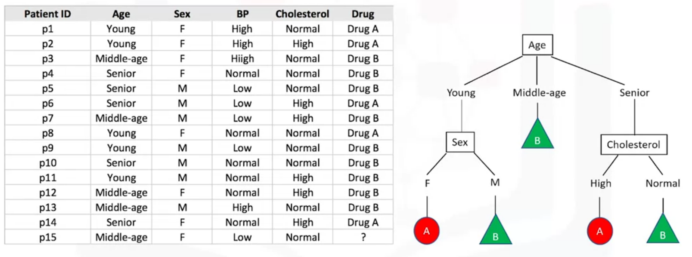
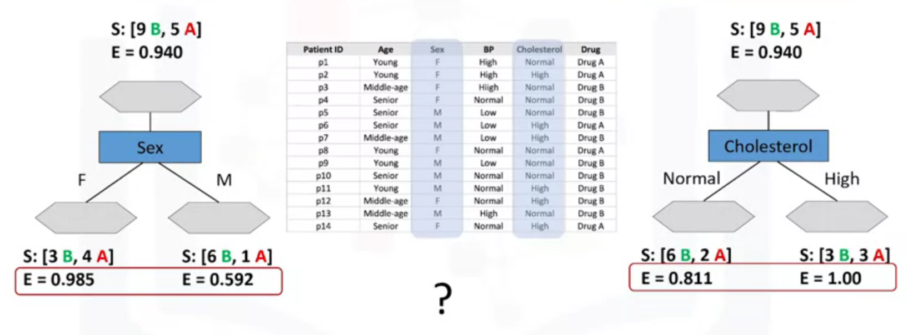
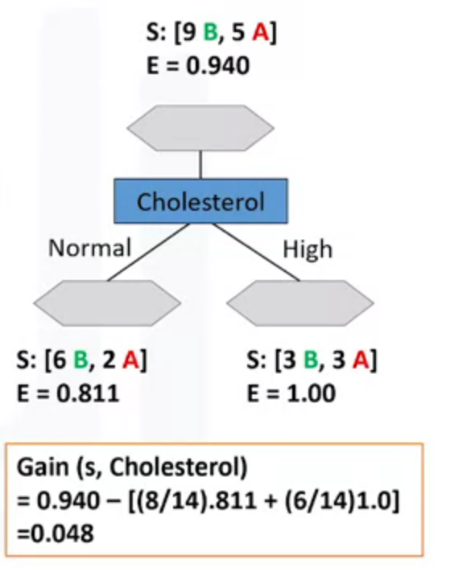
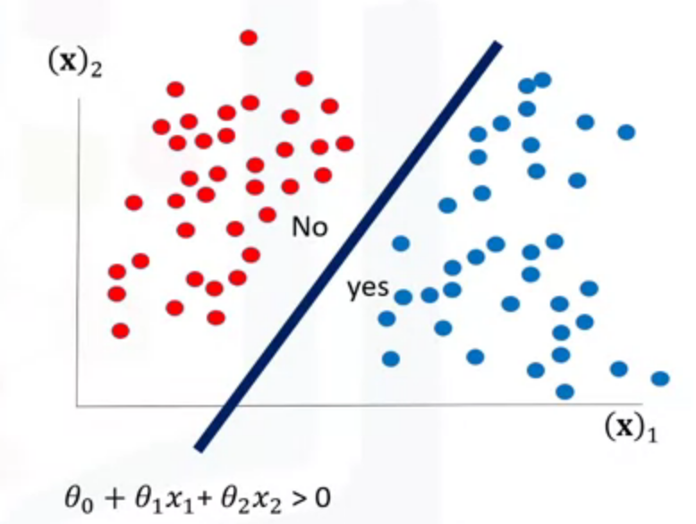
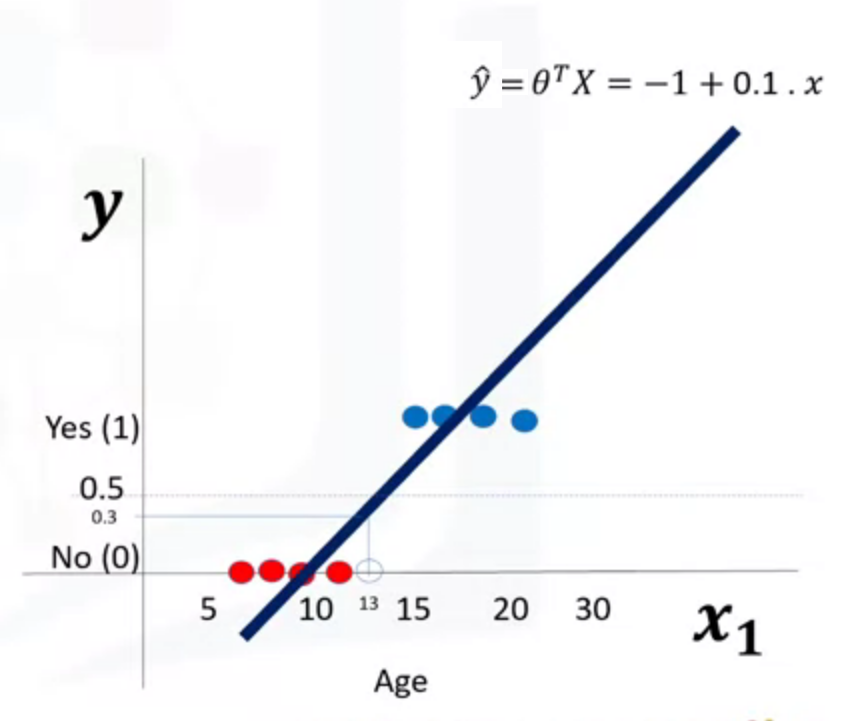
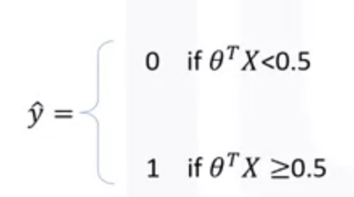
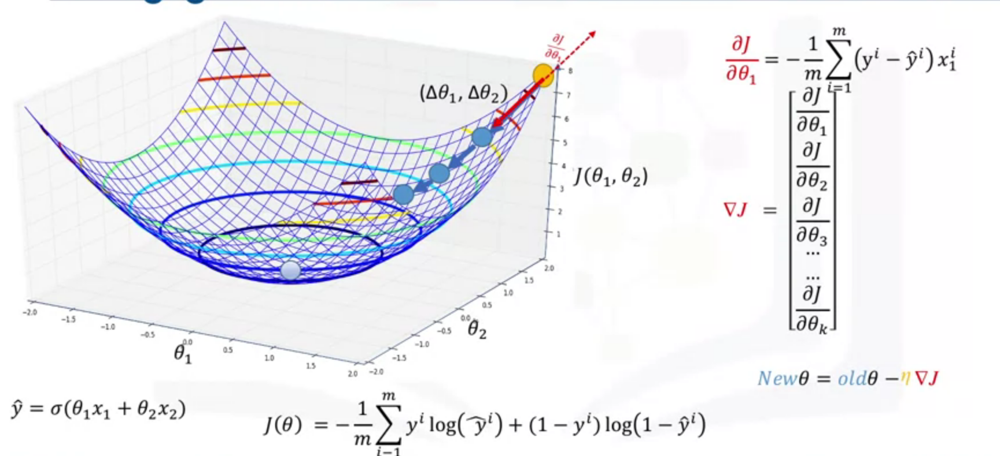
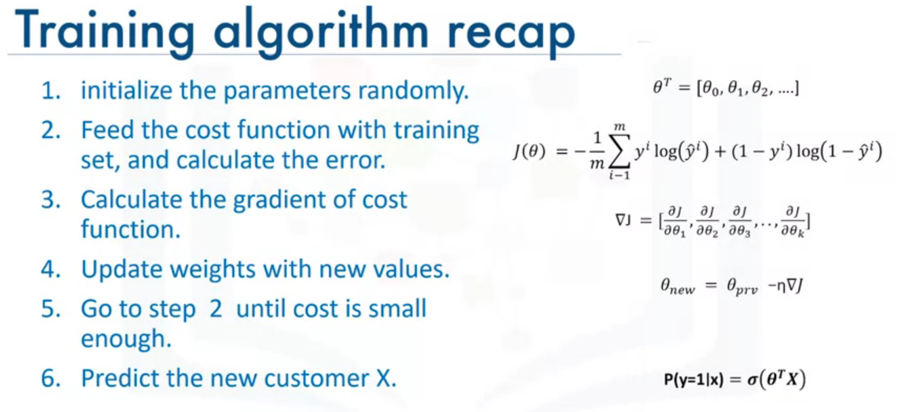
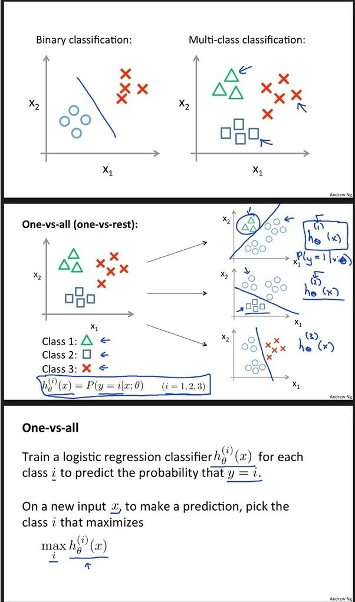

# Machine Learning with Python

These are some notes for the [Machine Learning with Python course](https://www.coursera.org/learn/machine-learning-with-python ), meant to accompany the ipython notebooks

# Week 1 - What is ML?

Major ML techniques:
- Regression/Estimation: for prediciting continuous values
    - e.g. estimating price of house
- Classification: predicting discrete class label or category for a case
   - e.g. is cell cancerous?
- Clustering: finding the structure of data; summarization; segmentation
   - e.g. segmentation of customers
- Associations: associating frequent co-occuring items/events
   - e.g. grocery items that are usually bought together
- Anomaly Detection: discovering abnormal and unusual cases
    - e.g. credit card fraud detection
- Sequence Mining; predicting next events
    - e.g. clickstream -- where will the user next click on a website?
- Dimension Reduction: reducing the size of data 
    - e.g. PCA
- Recommendation Systems: recommending items
    - e.g. spotify music


ML pipeline:

Note: After data preprocessing, we often need to perform feature selection and feature extraction before splitting train/test data.


- ML algorithms benefit from standardization of dataset. e.g. can use `sklearn.preprocessing.StandardScaler`
- can use `svm.SVC` as a classifier
- `sklearn.metrics` has various metrics for determining performance of ML model on test data. e.g. `confusion_matrix`
- can save sklearn models using `pickle`


- column names are called `attributes`
- columns are called `features`
- rows are called `observations`

## Supervised vs unsupervised learning:

### Supervised
How do we *supervise* a ML model? We 'teach the model' by training model with a labelled data-set. The outputs we expect are known. 

- deals with labelled data
- has more evaluation methods than unsupervised learning
- controlled environment

There are two types of supervised learning techniques:
- Classification:
- Regression:

### Unsupervised

Unsupervised learning: let the model discover information on its own. 
data is *unlabelled*

- deals with unlabelled data
- has fewer models and evaluation methods to ensure model is accurate,  than supervised learning
- less controlled environment, since the machine is creating outcomes for us. 

Commonn Unsupervised learning techniques:
- Dimension Reduction / Feature selection: - reduces redundant features/dimensions to make classification easier. 
- Density Estimation: used to explore data to find some structure within it. 
- Market basket analysis: based on theory that if you buy a certain group of items, you're more likely to buy this other group of items
- Clustering

#### Clustering
What is clustering?
- Clustering is grouping of data points or objects that are somehow similar. 
- Used for
   - discovering structure
   - summarization
   - anomaly detection
- most popular unsupervised technique for grouping data


# Week 2 - Regression

- dependant variable must be continuous

## Types of Regression:
- each type below can be linear or non-linear regression


- Simple Regression: only 1 independant variable is used to estimate the dependant
- Multiple regression: more than 1 independant variable is used. Each independant variable will need to be lienarly related to dependant.


## Applications of regression
- sales forecasting
- price estimation
- employment income

## Regression Algorithims:
- Oridnal Regression
- Poisson regression
- Fast Forest quantile Regression
- Linear, Polynomial, Lasoo, Stepwise, Ridge Regression
- Bayesian Linear Regression
- Neural Network regression
- Decision Forest regression
- Boosted decision tree Regression
- KNN (K-nearest neighbors)
   - Although mainly used for classification, [This](https://towardsdatascience.com/the-basics-knn-for-classification-and-regression-c1e8a6c955) describes how KNN can be used for regression

## Evaluation Metrics
- MAE - Mean Absolute Error
- MSE - Mean Squared Error
- RMSE - Square root of MSE. 
- RAE - Relative absolute error / Residual sum of square
- RSE
- R^2 = 1 - RSE

## MLR

How to find coefficents for MLR?
- OLS; minimizes MSE. Uses lin alg operations. Can take a long time for large dataset (>10k rows)
- Optimization algorithim. e.g. Gradient descent. 


Using multiple independant variables can often give better results than SLR. But adding too many independant variables without any real theoretical justification can result in an overfit model (no longer general enough for unseen data)


Explained variance regression score: `= 1- Var(y-y_hat)/Var(y)`
- higher values are better


## Non-linear Regression

### Polynomial Regression
- polynomial regression model can be transformed into a linear regression model, where the `x` variables, simply map to some other non-linear variable. 
- e.g. `x_2 = x^3 in y = m*x + m_2*x_2 + b`
- therefore, can use LeastSquares

### Other non-linear regression
- For a function to be non-linear, `y_hat` must be non-linear function of parameters `w` (coefficents), not necassarily the features `X` 
    - e.g. `y=log(w_0 + w_1*x + w_2*x^2 +..._)`
    - e.g. `y= w_0 + w_1*w_2^x`
- cannot use OLS to fit regression
- estimation of paramters is not easy. 

- for a a sigmoid function (as an example) we can use `scipy.optimize.curve_fit`, which uses non-linear least squares to fit a function, to the data.

# Week 3 - Classification

Classification:
- supervised learning approach
- categorizing items into a discrete set of categories/classes
- target attribute is a *categorical variable*
- e.g. determining if bank customer will default on loan or not (binary classification)
- e.g. Determining appropriate medication for patient with a similar illness (multi-class classification)

## Classification Algorithims:
- Decision Trees
- Naive Bayes
- Linear Discriminant Analysis
- KNN (K-nearest neighbour)
- Logisitic Regression
- SVM (Support vector machines)
- Neural networks

## K-Nearest Neighbours
We choose a class as a predicition by looking at the `K` nearest neighbors

- method for classifying cases based on their similarity to other cases
- KNN approach is based on the fact that similar cases with same class labels are near each other
- cases that are "near" to each other are said to be `neighbours`
- distance between two cases (e.g. Euclidean distance) is a measure of their similarity.

Algorithim:
1. Pick a value of `K`
2. Calculate the distance of unknown case from all (labelled/known) cases
3. Get the `K`-observations in the training data that are "nearest" to the unknown data point.
4. Predict the class of the unknown data point using the most popular class from the `K`-nearest neighbours

Note: out-of-sample data can't be trusted to be used for prediction of unknown samples

```python
from sklearn.neighbors import KNeighborsClassifier
# sklearn's KNN uses Euclidean distance by default
neigh = KNeighborsClassifier(n_neighbors=3) 
neigh.fit(X_train, y_train)
yhat=neigh.predict(X_test)
```


There are two slight concerns here:
- how do we select the right `K`?
- how do we calculate similarity / distance between two data points?


### Calculate similarity / distance between two data points
- can use [Minkowski distance](https://en.wikipedia.org/wiki/Minkowski_distance). Generally, we use the [Euclidean distance](http://mathonline.wikidot.com/the-distance-between-two-vectors) form. 
    - each data point is a _vector_, where components of the vector are the data point features (e.g. age, gender, income etc.)
    - find the distance between each vector.
    - Note: need to normalize all features before calculating Euclidean distance. 


There are other dissimilarity measurements that could be used, but it is highly dependant on data type and domain the classification is done for. 


### Selecting the right `K`
if we choose a:
- really low value of `K` (e.g. `K=1`):
    - tend to capture noise or anomolies in data
    - creates highly complex model, would most likely result in overfitting 
    - not generalized enough to be used for out-of sample cases. 
- really high value of `K` (e.g. `K=20`):
    - model becomes overly generalized


So how do we choose a value of `K` then?
- Try training the model for different values of `K`
- determine accuracy of each model varaint on the validation/test data set. 
- Select `K` that gives highest accuracy. 


## Evaluation Metrics in Classification 

- compare actual labels, with predicted labels

### Jaccard Index

- Jaccard = size of intersection, divided by size of union
- a.k.a `IoU = intersection / union`
- higher is better

```python
from sklearn.metrics import jaccard_score¶
```

e.g.
- `y=[0,0,0,0,0,1,1,1,1,1]`
- `y_hat=[1,1,0,0,0,1,1,1,1,1]`
- `IoU = 8/(10+10-8) = 0.66`


### F1 Score

In below definitions, we consider the case of binary classification:

When classifying data, we can tally the comparison of predicted label with actual label into groups: True Positive, True Negative, False Positive, and False Negative.


#### Confusion Matrix
A confusion matrix `C` is a square matrix where `Cij` represents the number of instances known to be in group `i` (true label),and were predicted to be in group `j` (predicted label).
- rows show actual labels
- columns show predicted labels by the model
- diagonal elements are correctly predicted labels, while off-diagonal elements are those that were mislabeled by the classifier.
- Note: above definition could be transposed...

In `sklearn`,

```python
from sklearn.metrics import confusion_matrix
confusion = confusion_matrix(y_true, y_pred)
# confusion is a 2D array.
```
See the [sklearn documentation](https://scikit-learn.org/stable/modules/model_evaluation.html#confusion-matrix) for more


`sklearn`'s `plot_confusion_matrix` gives a plot similar to:


#### Accuracy
- number of correctly classified instances over total number of instances
- fraction of total samples that were correctly classified.
- can be misleading for unbalanced datasets, therefore not necassarily always a good measure

```python
from sklearn.metrics import accuracy_score
```


#### Precision
- Out of all the predicted positive, what percentage is truly positive?
- should ideally be `1`

```python
from sklearn.metrics import precision_score
```


#### Recall
- Out of all the total positive, what percentage is correctly predicted as positive?
- should ideally be `1`

```python
from sklearn.metrics import recall_score
```


#### F1 Score
- harmonic average of `Precision` and `Recall`
- higher value == higher accuracy. Should ideally be `1`
- shows model has good precision and recall

```python
from sklearn.metrics import f1_score
```


- there is also a _weighted_ F1 Score, in order to give more importance to `Precision` or `Recall`, depending on the requirements. For example, classifying a sick person as healthy would have a different weight as classifying a healthy person as sick.

To find F1 score of a model, 
- calculate for each class 
- Average accuracy of classifier is the average F1 score of all labels (a.k.a Macro F1)

In multiclass clasification, the confusion matrix would look like this:. The green cells are "True Positives" for each class. Thus, `Precision, Recall, F1` etc. is calculated seperately for each class. The example below shows groups of counts, based on if calculating for the `Apple` class.


Can easily calculate precision, recall, and f1 score for all classes in multi-class classifier using 
```python
from sklearn.metrics import classification_report
```

From the [sklearn documentation](https://scikit-learn.org/stable/modules/model_evaluation.html#classification-report), it would output something like

```
              precision    recall  f1-score   support

     class 0       0.67      1.00      0.80         2
     class 1       0.00      0.00      0.00         1
     class 2       1.00      0.50      0.67         2

    accuracy                           0.60         5
   macro avg       0.56      0.50      0.49         5
weighted avg       0.67      0.60      0.59         5
```


#### Links:
- https://medium.com/analytics-vidhya/confusion-matrix-accuracy-precision-recall-f1-score-ade299cf63cd
- https://towardsdatascience.com/performance-metrics-confusion-matrix-precision-recall-and-f1-score-a8fe076a2262
- https://towardsdatascience.com/confusion-matrix-for-your-multi-class-machine-learning-model-ff9aa3bf7826
- https://towardsdatascience.com/multi-class-metrics-made-simple-part-i-precision-and-recall-9250280bddc2


### Log Loss
- a.k.a. `Cross-entropy loss`
- for classifiers where the predicted output is a *probability* of the label between 0 and 1, instead of the label itself. 
- increases as predicted probability divergers from actual label (probability of `1`)
- Good classifier models have smaller values of LogLoss.
- e.g. predicting a probability of 0.13 that the data point belongs to class `x`, when the actual label is 1, would be bad, and result in a high log loss.

Let:
- `M` - number of classes (e.g. 3 for (dog, cat, fish))
- `y` - binary indicator (0 or 1) if class label `c` is the correct classification for observation `o` (Label says 'true' probability=1)
- `p` - predicted probability that observation `o` is of class `c`

To find the Log Loss of a model:

1. Calculate log loss for each row

Log Loss equation to measure how far each predicition is from the actual label:


Note: the `log` in log loss is actually `ln`. [Since errors are proportional with `ln` vs `log`](https://datascience.stackexchange.com/questions/57009/why-doesnt-the-binary-classification-log-loss-formula-make-it-explicit-that-nat), the base of the logarithim doesn't matter.

2. Then calculate average log loss across all rows of the test set. 


If `M`>2 (i.e. multiclass classification), we calculate a separate loss for each class label per observation and sum the result.


- https://ml-cheatsheet.readthedocs.io/en/latest/loss_functions.html#loss-cross-entropy

## Decision Trees
- basic intuition behind a decision tree is to map out all possible decision paths in the form of a tree
- built by spliting training set into distinct node. One node in a decision tree contains all or most of, one category of the data. 
- basically a flowchart:
    - each internal node is a 'test'
    - each 'branch' is a result of the test
    - each leaf node assigns a classification.
    
```python
from sklearn.tree import DecisionTreeClassifier
```

e.g. Suppose we are predicting which of 2 drugs would be most appropriate for a new patient. A decision tree can be built from the data's attributes



### Building a decision tree
A decision tree is built by considering the attirbutes / features of the data, 1 by 1
1. Choose an attribute from your dataset
2. Calculate the significance of attribute in splitting of data (this shows whether the attribute is effective)
3. Split data based on the value of the best attribute
4. Go to each branch and repeat from step 1 for the rest of the attributes

- Decision Trees are built using recursive partioning to classify the data. 
- choose the most predictive feature to split the data on. 
    - the split should result in nodes that are more pure. (Nodes that are mostly one class or another)

Attribute that results in a more _pure_ split are more **significant** or **predictive** than the other attributes. This means the nodes are less impure.
- A node is considered _pure_ if 100% of the cases fall into the same category of a target class.
- The method uses recursive partiionining to split training data into segments by miniziming impurity at each step. 
- impurity of nodes are calculated by **entropy** of data in the node. 

### Entropy 
- measure of randomness or uncertainity
- the lower the Entropy, the less uniform the distribution, and the purer the node.
- used to calculate impurity at each node. We want impurity to decrease at each step in the tree. 
- Node is homogenous (all data in node is of 1 target class) --> Entropy=0
- Node has data that is evenly split between 2 classes --> Entropy=1

`Entropy = -p(A)log(p(A))-p(B)log(p(B))`

- `p(A)` = proportion / ratio of category e.g. `class A` in this case.
- e.g. if there are 5 instances with target `A` and 9 of `B`, then `p(A)=5/14` and `p(B)=9/14`

### How to know which attribute is the best to divide the dataset?



To answer this question, we try to answer the following:
- which attribute results in purer nodes after the split
- which tree do we have less entropy after splitting, rather then before splitting?

Answer: The tree with the higher **Information Gain** after splitting is better. 

### Information Gain
- the information that can increase the level of certainity after splitting

`Information Gain = (Entropy before split) - (weighted entropy after split)`
- `(weighted entropy after split)` is weighted by porportion of samples falling into that leaf.
- as impurity / entropy decreases, information gain increases

Below is an example of calculating Information Gain



Now we just recursively do this

### Using Categorical data in Decision Trees

Scikit-learn's `DecisionTreeClassifier` does not work with categorical data. To work with categorical data, we need to convert it into a numerical form using either: `LabelEncoder`, `OrdinalEncoder`, `OneHotEncoder`.

[`LabelEncoder`](https://scikit-learn.org/stable/modules/generated/sklearn.preprocessing.LabelEncoder.html) is meant for targets and is not meant to be used for features. Instead, use `OrdinalEncoder` or `OneHotEncoder`
- we try to avoid using LabelEncoder since it implicitly shows a ranking/relation between labels of a feature, while this may not make sense in real life.
- For data that has a ranking behaviour (e.g. low, medium high) --> use `OrdinalEncoder`. This maps ranked data to 0, 1, 2. 
    - Similar to using a `LabelEncoder`
- For data that is not ranked E.g. gender (M,F) --> use `OneHotEncoder`
    - One hot encodes the data.
    
`pandas`'s `.get_dummies()` is another way to use get OneHotEncoded values.


Relevant links:
- https://stackoverflow.com/questions/38108832/passing-categorical-data-to-sklearn-decision-tree 
- https://stackoverflow.com/questions/47873366/can-sklearn-decisiontreeclassifier-truly-work-with-categorical-data
- https://scikit-learn.org/stable/modules/preprocessing.html#encoding-categorical-features


## Logistic Regression
- classification algorithimn for categorical target variables
- similar to LinearRegression, but tries to predict a discrete or categorical target field, instead of a continous numeric target. 
    - target can be binary or multi-class classification
    - e.g. "will customer switch services next term?" --> Target classes: "Yes, No"
- independant variables need to be continous / numeric. If data is categorical, it needs to be converted to dummy or indicator coded (OneHotEncoded or LabelEncoded).
    - we also encode the target variables to a numerical value (e.g. 0, or 1 for binary classification).
- returns a probability score in range `[0,1]` for a given sample of data. Then , maps results of probability to a discrete clas

In further notes below, binary classification is discussed.



### Applications of LogisiticRegression
- prediciting probability of person having a heart attack in a specified time period
- predict mortality in injured patients, or probability of having a disease
- predict customer's probability to purchase a new product or cancel a subscription
- predict probability of failure
- predict likelihood of homeowner defaulting on mortgage.

In all these examples, not only do we predict the class of each case, but we also predict the probability of a case belonging to a specific class. 


### When should Logisitic Regression be used?
- if target field is categorical, or binary. e.g 0/1, Yes/No
- if we need probabilistic results / need the probability of our prediction (target variable is "probability of ....")\
- if data is linearly seperable / when you need a linear decision boundary
    - Decision boundary of LogisiticRegression is a hyperplane.  
    - Decision boundary may also be polynomial. [Example pf circular decision boundary - Andrew Ng](https://youtu.be/F_VG4LNjZZw?t=856)
- for understanding impact of a feature on the target variable
    - coefficents on features that are approx. `= 0` show the features are not that statstically significant. They don't much impact on the target variable.

### Logistic Regression vs. Linear Regression

`y_hat = P(y=1|x)` --> i.e. y_hat = probability that output target labels vector = 1 for input row `x`

Suppose we try to do Linear Regression to predict categorical target variable.

Example: predicting whether customer churn exists, using their age. If we input 13, we can see an ouput of approximately 0.3. 



To be able to use the equation of the line found through regression, we will need to map outputs of the line, to categories. One way to do this, is using a unit-step function to map inputs to `[0,1]` Let's say our threshold is 0.5.



Among other problems with this, we also can't state the probability of an output class. Instead of unit step function, we can use the sigmoid function. Then, `y_hat = sigmoid(Theta^T*X) = P(y=1|x)` 

### Logistic / Sigmoid Function

Below is the Sigmoid equation. In this, `x = Theta^T*X` for us


As `S(x) --> 1`, `P(y=1|x) --> 1`


### Training Process

Output of a logistic regression model is probability that `x` belongs to a class. So we will try to increase accuracy of predicting the probability correctly. 

1. Initialize vector theta, with random values
2. Calculate `y_hat = sigmoid(Theta^T*X) = P(y=1|x)` for an input customer with features in `x` vector
3. Compare output of `y_hat` with actual ouput of customer `y` and record as error
4. Do Steps 2,3 for all customers. Add up the errors. Total error = cost of model 
    - Cost = J(theta) = Sum of errors
5. Change theta to reduce cost
6. Repeat from step 2. 

Usually, MSE is used for cost function. However, there would not be an easy way to find the global minimum of a MSE function involving the sigmoid equation. Instead, we use another cost function.


If desirable y = 1, we use


If desirable y = 0, we use


The total cost function for Logistic Regression is then,


In the above, `h_theta(x_i)` is `y_hat_i = sigmoid(Theta^T*X_i) `. The equation for `J(Theta)` penalizes situations where expected class is 0 and model output is actually 1, and vice versa. Remember, `y_hat` is not a class, but a value indicating probability between 0 and 1. 

To find the best parameters of the model, we minimize the cost function using `Gradient Descent`.

Gradient Descent
- a technique that uses derivative of cost function to change paramater values in order to minimize cost.
- need to calculate gradient of the cost function, at the current point. (Recall from multivariable calc, a `gradient` shows direction of greatest increase. The negative is then direction of steepest decrease)

We then update new values of theta using the following equation:


`nu` is the learning rate, which gives us control on how fast to move on the surface. Essentially, gradient gives us direction and learning rate scales the change in addition to the amount that gradient says to change by. 






When do we stop iterations?
- We stop training when the model has reached a satisfactory accuracy. Possibly through adding a callback, or a stopping point. 


### Mutliclass classification

This is just an extension of binary classification and can be done with 1 of the following approaches:

#### One vs. all (One vs. Rest)
- If we have to classify between 3 classes, we treat the problem as 3 seperate *binary* classification problems. 
    - We create 3 classifiers. Each classifier predicts 1 class vs. the rest
    - For predicting class of new input, we run the input through each classifier and pick the class with the highest probability. 
- [Andrew Ng's lesson](https://www.youtube.com/watch?v=DuXmFxDSc9U)



In the above image, "Probability that `y=i`" means the probability that output class is the expected class. 

#### Multinomial classification
An alternative is to use multinomial classification. i.e. uses softmax function instead of sigmoid, and cross-entropy loss for total cost function

### Scikit-Learn implementation.

```python
from sklearn.linear_model import LogisticRegression
model = LogisticRegression(multi_class='ovr')
model.fit(X, y)
```

The `LogisticRegression` has a parameter to choose between One-Vs.-Rest and Multinomial classification. See the [sklearn documentation](https://scikit-learn.org/stable/modules/generated/sklearn.linear_model.LogisticRegression.html).

Another scikit learn method for doing OVR is the [OVR strategy](https://scikit-learn.org/stable/modules/multiclass.html#ovr-classification), also shown in [this article](https://machinelearningmastery.com/one-vs-rest-and-one-vs-one-for-multi-class-classification/)

```python
from sklearn.multiclass import OneVsRestClassifier
from sklearn.linear_model import LogisticRegression
model = LogisticRegression()
# define the ovr strategy
ovr = OneVsRestClassifier(model)
```
