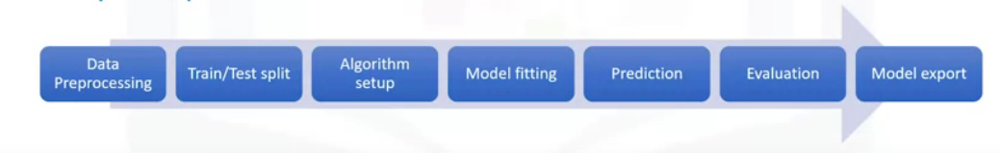

# Machine Learning with Python

These are some notes for the [Machine Learning with Python course](https://www.coursera.org/learn/machine-learning-with-python ), meant to accompany the ipython notebooks

# Week 1 - What is ML?

Major ML techniques:
- Regression/Estimation: for prediciting continuous values
    - e.g. estimating price of house
- Classification: predicting discrete class label or category for a case
   - e.g. is cell cancerous?
- Clustering: finding the structure of data; summarization; segmentation
   - e.g. segmentation of customers
- Associations: associating frequent co-occuring items/events
   - e.g. grocery items that are usually bought together
- Anomaly Detection: discovering abnormal and unusual cases
    - e.g. credit card fraud detection
- Sequence Mining; predicting next events
    - e.g. clickstream -- where will the user next click on a website?
- Dimension Reduction: reducing the size of data 
    - e.g. PCA
- Recommendation Systems: recommending items
    - e.g. spotify music

ML pipeline:

Note: After data preprocessing, we often need to perform feature selection and feature extraction before splitting train/test data.

- ML algorithhimis benefit from standardization of dataset. e.g. can use sklearn.preprocessing.StandardScalar
- can use `svm.SVC` as a classifier
- `sklearn.metrics` has various metrics for determining performance of ML model on test data. e.g. `confusion_matrix`
- can save sklearn models using `pickle`

- column names are called `attributes`
- columns are called `features`
- rows are called `observations`

## Supervised vs unsupervised learning:

### Supervised
How do we *supervise* a ML model? We 'teach the model' by training model with a labelled data-set. The outputs we expect are known. 

- deals with labelled data
- has more evaluation methods than unsupervised learning
- controlled environment

There are two types of supervised learning techniques:
- Classification:
- Regression:

### Unsupervised

Unsupervised learning: let the model discover information on its own. 
data is *unlabelled*

- deals with unlabelled data
- has fewer models and evaluation methods to ensure model is accurate,  than supervised learning
- less controlled environment, since the machine is creating outcomes for us. 

Commonn Unsupervised learning techniques:
- Dimension Reduction / Feature selection: - reduces redundant features/dimensions to make classification easier. 
- Density Estimation: used to explore data to find some structure within it. 
- Market basket analysis: based on theory that if you buy a certain group of items, you're more likely to buy this other group of items
- Clustering

#### Clustering
What is clustering?
- Clustering is grouping of data points or objects that are somehow similar. 
- Used for
   - discovering structure
   - summarization
   - anomaly detection
- most popular unsupervised technique for grouping data

# Week 2 - Regression

- dependant variable must be continuous

## Types of Regression:
- each type below can be linear or non-linear regression

- Simple Regression: only 1 independant variable is used to estimate the dependant
- Multiple regression: more than 1 independant variable is used. Each independant variable will need to be lienarly related to dependant.

## Applications of regression
- sales forecasting
- price estimation
- employment income

## Regression Algorithims:
- Oridnal Regression
- Poisson regression
- Fast Forest quantile Regression
- Linear, Polynomial, Lasoo, Stepwise, Ridge Regression
- Bayesian Linear Regression
- Neural Network regression
- Decision Forest regression
- Boosted decision tree Regression
- KNN (K-nearest neighbors)
   - Although mainly used for classification, [This](https://towardsdatascience.com/the-basics-knn-for-classification-and-regression-c1e8a6c955) describes how KNN can be used for regression

## Evaluation Metrics
- MAE - Mean Absolute Error
- MSE - Mean Squared Error
- RMSE - Square root of MSE. 
- RAE - Relative absolute error / Residual sum of square
- RSE
- R^2 = 1 - RSE

## MLR

How to find coefficents for MLR?
- OLS; minimizes MSE. Uses lin alg operations. Can take a long time for large dataset (>10k rows)
- Optimization algorithim. e.g. Gradient descent. 

Using multiple independant variables can often give better results than SLR. But adding too many independant variables without any real theoretical justification can result in an overfit model (no longer general enough for unseen data)

Explained variance regression score: `= 1- Var(y-y_hat)/Var(y)`
- higher values are better

## Non-linear Regression

### Polynomial Regression
- polynomial regression model can be transformed into a linear regression model, where the `x` variables, simply map to some other non-linear variable. 
- e.g. `x_2 = x^3 in y = m*x + m_2*x_2 + b`
- therefore, can use LeastSquares

### Other non-linear regression
- For a function to be non-linear, `y_hat` must be non-linear function of parameters `w` (coefficents), not necassarily the features `X` 
    - e.g. `y=log(w_0 + w_1*x + w_2*x^2 +..._)`
    - e.g. `y= w_0 + w_1*w_2^x`
- cannot use OLS to fit regression
- estimation of paramters is not easy. 

- for a a sigmoid function (as an example) we can use `scipy.optimize.curve_fit`, which uses non-linear least squares to fit a function, to the data.
