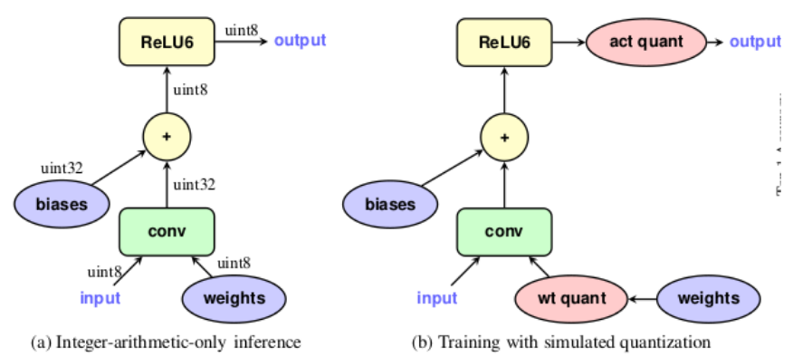
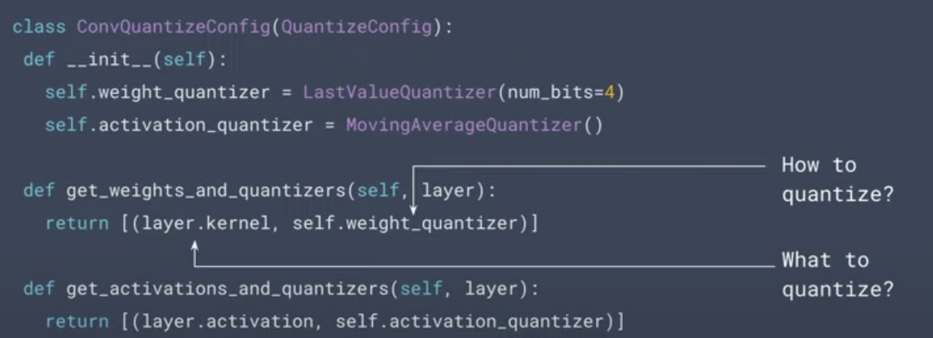
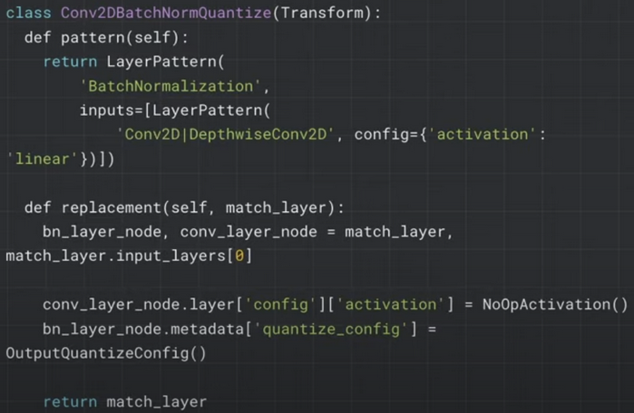

## QAT and the TensorFlow API

> Some notes on what QAT is, and its API in TensorFlow

In general, `Quantization` is the process of transforming an ML model into an equivalent representation that uses parameters and computations at a lower precision. 

[Post-training Quantization](https://www.tensorflow.org/model_optimization/guide/quantization/post_training) works by reducing the precision of the numbers used to represent a model's parameters, which by default are 32-bit floating point numbers. This results in a smaller model size and faster computation. It reduces CPU and hardware accelerator latency, processing, power, and model size with little degradation in model accuracy.  `tflite` is used to do this.

`Quantization aware training` helps train DNNs for lower precision INT8 deployment, without compromising on accuracy. This is achieved by modeling quantization errors during training which helps in maintaining accuracy as compared to FP16 or FP32. The `tensorflow model optimization toolkit (tfmot)`  is used to do this.

[Quantization aware training - TF Guide](https://www.tensorflow.org/model_optimization/guide/quantization/training)


* Quantization aware training emulates inference-time quantization, creating a model that downstream tools will use to produce actually quantized models
* Can configure the quantization parameters (e.g. number of bits) and the underlying algorithms. (Note: when not using API defaults, TF does not offer great support for deployment).
    * The simple APIs allow applying quantization to only Sequential and Functional tf.keras models
    * TF claims limited to no support for Subclassed models, but it can be done through their API.
    * [Quantization aware training - Support](https://www.tensorflow.org/model_optimization/guide/quantization/training#general_support_matrix) 
        * Outlines models supported for QAT
        * No support for RNN/LSTM _yet_

[TF Blog: Quantization Aware Training with TensorFlow Model Optimization Toolkit](https://blog.tensorflow.org/2020/04/quantization-aware-training-with-tensorflow-model-optimization-toolkit.html) 


* In general, Quantization losses accumulate
* The core idea is that QAT simulates low-precision inference-time computation in the _forward pass_ of the training process
* QAT introduces the quantization error as noise during the training and as part of the overall loss, which the optimization algorithm tries to minimize. Hence, the model learns parameters that are more robust to quantization.
* Training graph operates in float32. Tfmot interests special ops into the graph ([tensorflow::ops::FakeQuantWithMinMaxVars](https://www.tensorflow.org/api_docs/cc/class/tensorflow/ops/fake-quant-with-min-max-vars)) that convert the floating-point tensors into low-precision values (e.g. int8) and then convert the low-precision values back into floating-point.
    * This ensures quantization losses are introduced in the computation and that further computations emulate low-precision
    * > “since each value in the floating-point tensor now maps 1:1 to a low-precision value, any further computation with similarly mapped tensors won’t introduce any further loss and mimics low-precision computations exactly.”



* `wt quant` and `act quant` ops above introduce quant losses in the forward pass of the model to simulate actual quantization loss during inference
* no Quant operation between Conv and ReLU6 because ReLUs get fused in TensorFlow Lite.

Simple usage of API for quantizing entire Keras model:


```python
import tensorflow_model_optimization as tfmot

model = tf.keras.Sequential([
   ...
])
# Quantize the entire model.
quantized_model = tfmot.quantization.keras.quantize_model(model)

# Continue with training as usual.
quantized_model.compile(...)
quantized_model.fit(...)
```


Simple usage of API for quantizing part of a Keras model:


```python
import tensorflow_model_optimization as tfmot
quantize_annotate_layer = tfmot.quantization.keras.quantize_annotate_layer

model = tf.keras.Sequential([
   ...
   # Only annotated layers will be quantized.
   quantize_annotate_layer(Conv2D()),
   quantize_annotate_layer(ReLU()),
   Dense(),
   ...
])
# Quantize the model.
quantized_model = tfmot.quantization.keras.quantize_apply(model)
# Compile and Train
```


The `tfmot` API allows us to control quantization precisely within a layer, create custom quantization algorithms, and handle any custom layers that we have written.

[Youtube - Inside TensorFlow: Quantization aware training](https://www.youtube.com/watch?v=Q1oBXdizXwI) 


* Where are Quantization losses introduced? (when moving to a device, without having done QAT)
    * Weights represented as int8 instead of float32
    * Computations (e.g. MatMul) happen in int8, accumulate to int32 then are rescaled back to int8
    * Tflite inference graph has ReLU fusing
* TF uses uniform/linear map quantization - mapping a limited float32 range to the int8 range. 
* QAT makes the training path as similar as possible to the inference path. 
* Goal is to mimic errors experienced by the model during inference in training.

    To mimic errors, TF uses `FakeQuant` - in forward pass of training: quantizes tensors to lower precision, then convert back to floating point. 

* > Since we do FakeQuant on both inputs and weights, the floating point value after the dequantization step is actually an exact representation of mapping 1:1 to an int8 value. So Now when you do your matmuls, your computation is exactly mimicking what happens in int8 because all your floating point numbers line up neatly with buckets in int8.  [Timestamp](https://youtu.be/Q1oBXdizXwI?t=539)
    * This makes sense, till there is an overflow or we’re doing floating point division?

QAT API previously mentioned in the blog post applies. Can also quantize a custom layer by passing a `quantize_config` class for the a layer:


```python
import tensorflow as tf
import tensorflow_model_optimization as tfmot
quantize_annotate_layer = tfmot.quantization.keras.quantize_annotate_layer

model = tf.keras.Sequential([
   quantize_annotate_layer(Conv2D(), quantize_config=ConvQuantizeConfig()),
   ReLU(),
   ...
])

quantized_model = tfmot.quantization.keras.quantize_apply(model)
# Compile and Train
```


Where the ConvQuantizeConfig is defined by us as something like:



Tells 2 things:

* How to quantize the layer
* What parts of the layer to quantize
* Can write a custom Quantizer scheme. A `Quantizer` to a `tensor` is what a `QuantizeConfig` is to a `layer`

Model Transforms


* Can write our own ModelTransforms to make the training part mimic the inference path. 
    * E.g. fuse layers together (ReLU is fused to conv in tflite)
    * By default, TF provides a repo of ModelTransforms, which takes care of the built in layers for the int8 default quantization scheme that exists
    * Can define a model transform, if you want to do more fancy stuff
* Basically define a pattern to look for in the model, and define how to replace the subset of the graph. 
* Note: no documentation on this seems to exist, but the functionality and samples are available in the `tfmot` repo.
    * [CONV+BN+ReLU doesn't get merged (through Transform) with custom quantization · Issue #552 · tensorflow/model-optimization](https://github.com/tensorflow/model-optimization/issues/552) 
    * [tensorflow/model-optimization/default_8bit_transforms.py - GitHub](https://github.com/tensorflow/model-optimization/blob/master/tensorflow_model_optimization/python/core/quantization/keras/default_8bit/default_8bit_transforms.py) 
    * Here is a link to the [Graph Transform Tool](https://github.com/tensorflow/tensorflow/tree/master/tensorflow/tools/graph_transforms) for a TensorFlow model. It has a C++ API. ModelTransforms is the analogous version for a Keras model.

E.g. ModelTransform to replace a Conv2D followed by BatchNorm, by another subset.



[Youtube - Optimize your models with TF Model Optimization Toolkit (TF Dev Summit '20)](https://youtu.be/2tnWHCxP8Bk?t=473)
* Covers same info as previous video
* With QAT the general idea is to:
    * Quant inputs + dequant
    * Quant weights + dequant
    * Matmul them
    * Quant output above + dequant

https://www.tensorflow.org/model_optimization/guide/quantization/training_example
* End to end example of QAT involving:
    * Training a model for MNIST
    * Fine-tuning the model by applying QAT APIs
    * Exporting model to tflite backend
    * Verify accuracy in tflite is matching QAT model
* After applying QAT API to whole keras model, each layer is prefixed by “quant_” in model.summary()
* The resulting model is Quantization aware,  but not quantized (e.g. the weights are float32 instead of int8).
    * It makes sense that the weights are kept as float32, so that back-propagation can still occur accurately
* To actually quantize the model with int8 weights and uint8 activations, use tf.lite.TFLiteConverter with a representative dataset

[Paper: “Quantization and Training of Neural Networks for Efficient Integer-Arithmetic-Only Inference”](https://arxiv.org/pdf/1712.05877.pdf), from 2017

* Note: not exact same implementation as tfmot, but introduces some concepts.
* Outlines a quantization scheme that allows inference to be carried out using int-only math, and a training procedure (QAT) to preserve post-quant accuracy
    * They quantize weights and activations is int8, but leave bias as int32
* Their quantization scheme is implemented using integer-only arithmetic dur-
* ing inference and floating-point arithmetic during training
    * They say that this scheme is also the one adopted in TFLite
    * `r = S(q-Z)`, where `q` is the quantized int8, and `r` is the float32 representation
    * Single set of quant params is used for all values in an activation array and within each weights array. Separate arrays have separate quant params
    * `S` (scale) is a float32 unquantized value. 
    * `Z` (zero-point) is quantized like `q`, and is the quant value q corresponding to real value 0
    * To perform integer-only matrix multiplication:
        * They formulate a quantized matrix multiplication for the multiplication of 2 square NxN matrices of real numbers `r1`, `r2`
        * See equations 7-9 in the paper (Sections 2.2 and 2.3 or pg 3-4)
            * The formula in eqn 9 is `q1*q2` --- Accumulating products of 2 uint8 values needs an int32 accumulator. (eqn 10)
        * [Possible related pseudocode](https://github.com/google/gemmlowp/blob/master/doc/quantization.md)
* QAT simulates quantization effects in _forward pass_ of training. Backpropagation still happens as usual, and all weights and biases are stored in floating point so that they can be easily nudged by small amounts. 
* The forward propagation pass simulates quantization by implementing, _in floating-point arithmetic_, the rounding behavior of the quantization scheme
    * Weights are quantized before being used in calculations
    * Activations are quantized after the activation function is applied to previous layer’s unquantized outputs.
    * “All variables and computations are carried out using 32-bit floating point math”
* Suggested using `ReLU6` rather than `ReLU` for on-device, since output is capped to `6`

[TF's Quantization aware training comprehensive guide](https://www.tensorflow.org/model_optimization/guide/quantization/training_comprehensive_guide) 


* demos use cases and how to use API. Topics covered include:
    * Defining an 8-bit quant-aware model and training + post quantizing it
    * Experimenting with QAT - Custom QuantizeConfigs, Quantizing custom Keras layers, modifying config params
* Note: a quantization aware model is not actually quantized. Creating a quantized model is a separate step.
* It's generally better to finetune with quantization aware training as opposed to training from scratch.
* Simple API (Easy)
    * `tfmot.quantization.keras.quantize_model(base_model)` to make whole model quant aware
    * `tfmot.quantization.keras.quantize_annotate_layer(layer)` and then `tfmot.quantization.keras.quantize_apply(annotated_model)` to make some layers quant aware
* More complex API ([Subsection on Experimenting with Quantization (e.g. supporting custom Keras layers)](https://www.tensorflow.org/model_optimization/guide/quantization/training_comprehensive_guide#experiment_with_quantization))
    * `Quantizer`
        * For implementing a custom scheme to quantize a single tensor, other than [provided schemes](https://www.tensorflow.org/model_optimization/api_docs/python/tfmot/quantization/keras/quantizers)
    * `QuantizeConfig`
        * AbstractBaseClass that will define how to quantize which weights, activations, and outputs of a layer
        * Need to subclass this when defining a QuantizeConfig for a custom layer.
        * Abstract methods: `get_weights_and_quantizers`, `get_activations_and_quantizers`, `set_quantize_weights`, `set_quantize_activations`, `get_output_quantizers`
            * `get_*` methods returns the activation/weight to be quantized and how. Tells TF quantizing code which activations/weights in a layer should be quantized (in forward pass)
            * `set_*` methods replace the activations/weights in a layer with their quantized version (when called by TF i.e. right after the `get_*`)
    * [Guide](https://www.tensorflow.org/model_optimization/guide/quantization/training_comprehensive_guide#quantize_custom_keras_layer) shows how to quantize a custom Keras layers:
        * Apply `tfmot.quantization.keras.quantize_annotate_layer(layer)` to the `CustomLayer` and pass in the `QuantizeConfig`.
        * Use `tfmot.quantization.keras.quantize_annotate_model` to continue to quantize the rest of the model with the API defaults
        * Then `tfmot.quantization.keras.quantize_apply` to apply the quant aware to model, inside of a `quantize_scope` context
    * Bias should not be quantized to fewer than 32 bits

[Module: tfmot.quantization.keras - QAT API Docs](https://www.tensorflow.org/model_optimization/api_docs/python/tfmot/quantization/keras) 

https://github.com/tensorflow/model-optimization/tree/master/tensorflow_model_optimization/python/core/quantization/keras/default_8bit
* There looks to be some default 8-bit quantizer and quantizeConfig stuff here, not mentioned in the docs.

## Background Info
Below links and notes are useful for background info. Most of the heavier-content and TF-specific is in above notes. 

[Lei Mao's Log Book – PyTorch Quantization Aware Training](https://leimao.github.io/blog/PyTorch-Quantization-Aware-Training/)


* QAT is process of training the model in a way that takes the effect of quantization into account. This ensures that there is a minimal performance drop when running on Edge Devices which have quantized weights and math operations
* Quantization is simulated by placing “fake quantization” modules to convert floating point variables to lower precision (int) variables by monitoring _scales_ and _zero points_ of weights and activations

[Inside Quantization Aware Training | by Vaibhav Nandwani | May, 2021](https://towardsdatascience.com/inside-quantization-aware-training-4f91c8837ead)


*  As we move to a lower precision from float, we generally notice a significant accuracy drop as this is a lossy process. This loss can be minimized with the help of QAT. So basically, quant-aware training simulates low precision behavior in the forward pass, while the backward pass remains the same. This makes our parameters more robust to quantization, hopefully making the actual post-training quantization almost lossless.
* We introduce `FakeQuant` nodes into our model after every operation involving computations to obtain the output in the range of our required precision. A `FakeQuant` node is basically a combination of `Quantize` and `Dequantize` operations stacked together
    * `scale` param scales back the low-precision value back to floating point values. Stored in full precision for better accuracy
    * `zero-point` is a low-precision val that represents quantized value that will represent the real value 0
* This article explains the math of calculating and using `scale` and `zero-point` for weights
* `scale` and `zero-point` have different values for weights and activations
* Quantize operations are applied to weights and activations with following rules:
    * Weights need to be quantized before they are multiplied or convolved with the input.
    * Outputs of each layer are generally quantized after the activation layer like Relu is applied to them
    * We also need to quantize the outputs of layers like Concat and Add where the outputs of several layers are merged
    * We do not need to quantize the bias during training as we would be using int32 bias during inference and that can be calculated later on with the parameters obtained using the quantization of weights and activations

[Google Releases Quantization Aware Training for TensorFlow Model Optimization](https://www.infoq.com/news/2020/04/google-tensorflow-optimization/) 


* TensorFlow’s QAT API also supports simulation of custom quantization strategies which allows researchers to target their models for other platforms and quantization algorithms beyond those currently supported by TensorFlow
* With QAT, the quantization errors become part of the loss metric which is minimized by the training process. Thus, model is trained to compensate for quantization errors.
* Since the quantization of data inputs and hidden-layer activations requires scaling of these values, the quantization algorithm needs some knowledge of the distributions of this data; particularly their maximum and minimum values. QAT maintains statistics needed to choose good scaling factors; in essence, "learning" the proper quantization of data.

https://www.mindspore.cn/tutorial/training/en/master/advanced_use/apply_quantization_aware_training.html
* Function of Fake Quantization node:
    * Find the distribution of network data, that is, find the maximum and minimum values of the parameters to be quantized.
    * Simulate the accuracy loss of low-bit quantization, apply the loss to the network model, and transfer the loss to the loss function, so that the optimizer optimizes the loss value during training.
* During the training, floating-point numbers are still used for computation, and network parameters are updated through backward propagation learning, so that the network parameters can better adapt to the loss caused by quantization.
